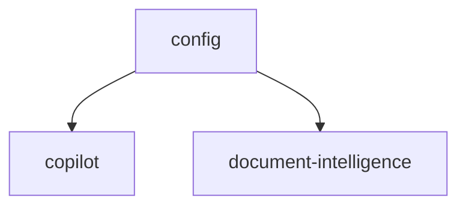

# AI & Automation

Workflow builder, AI copilot, document intelligence, and model configuration. **Panel:** `/ai` (Indigo) — Phase 3.

**Displaces**: Zapier, Make, Workato

---

## Navigation Groups

- **Workflows** — Workflow Builder, Run History
- **Copilot** — Chat
- **Document Intelligence** — Extractions
- **Settings** — AI Model Configuration, Usage

---

## Modules

| Module | Key | Status | Priority | Depends on (intra-domain) |
|---|---|---|---|---|
| [[domains/ai/model-config\|AI Model Configuration]] | `ai.config` | planned | p3 | — (build first: LlmGateway) |
| [[domains/ai/workflow-builder\|Workflow Builder]] | `ai.workflows` | planned | p3 | — (no LLM dep) |
| [[domains/ai/copilot\|AI Copilot]] | `ai.copilot` | planned | p3 | config |
| [[domains/ai/document-intelligence\|Document Intelligence]] | `ai.document-intelligence` | planned | p3 | config |

## Dependency Graph (intra-domain)



## Cross-Domain Edges

No events fired/consumed of its own. `ai.workflows` subscribes generically to ALL event-bus contracts as triggers (same universal-listener pattern as core.webhooks); actions execute through owning modules' services.

---

## Status Board (Dataview)

```dataview
TABLE module-key AS "Key", status AS "Status", priority AS "Priority"
FROM "domains/ai"
WHERE type = "module"
SORT module-key ASC
```

---

## Key Patterns

- `LlmGateway` (ai.config) = the single LLM call path: budget hard-stop, usage metering, fallback, encrypted keys
- Copilot data access ONLY via permission-checked, CompanyScope-bound tools — never free-form queries
- Prompt-injection guardrails ([[architecture/security]])
- Document extraction always behind human review + target-module DTO validation
- Token usage metered → usage-based billing candidate ([[product/pricing-model]])
