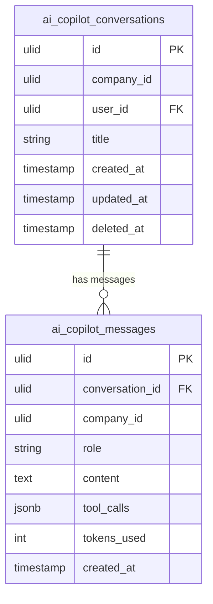

# AI Copilot — Data Model

Tables owned: `ai_copilot_conversations`, `ai_copilot_messages`. These are the **only** tables copilot writes. All other data is read through domain services (see [[_module|Cross-Domain Edges]]).

---

## ai_copilot_conversations

One chat thread, **private to its owning user** (second-layer scope on top of `CompanyScope`).

| Column | Type | Constraints | Notes |
|---|---|---|---|
| id | ulid | PK | |
| company_id | ulid | indexed | `BelongsToCompany` |
| user_id | ulid | FK → users, indexed | owner; conversations are private to this user |
| title | string | nullable | auto-derived from first message *(assumed)* |
| created_at | timestamp | | |
| updated_at | timestamp | | |
| deleted_at | timestamp | nullable | soft delete |

---

## ai_copilot_messages

Append-only turn log for a conversation.

| Column | Type | Constraints | Notes |
|---|---|---|---|
| id | ulid | PK | |
| conversation_id | ulid | FK → ai_copilot_conversations, indexed | cascade on conversation delete |
| company_id | ulid | indexed | denormalised for scope + tenant checks |
| role | string | not null | `user` / `assistant` / `tool` |
| content | text | not null | rendered as text only, never executed/HTML |
| tool_calls | jsonb | nullable | tool invocations + their data-only results |
| tokens_used | int | default 0 | metered via `LlmGateway` |
| created_at | timestamp | not null | |

No `encrypted` fields. Messages are not soft-deleted individually — they cascade with the conversation *(assumed)*.

---

## ERD

Both tables are `company_id`-scoped; conversations add a second-layer `user_id` privacy filter. Provider config lives in [[../model-config/data-model|ai.config]] (the v1 spec's `ai_copilot_config` table was dropped *(assumed)* — see [[unknowns]]).
