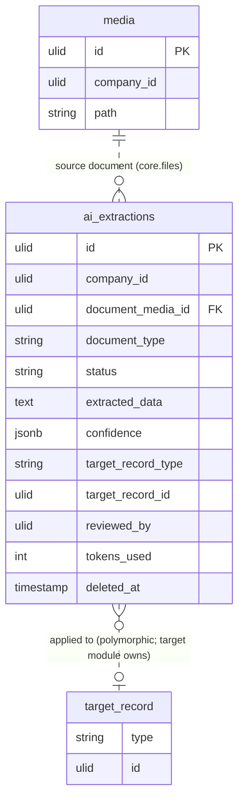

# Document Intelligence — Data Model

Tables owned: `ai_extractions` (the only table this module writes).

---

## ai_extractions

One row per uploaded document; carries the extracted fields, confidence, and (once applied) the link to the target record.

| Column | Type | Constraints | Notes |
|---|---|---|---|
| id | ulid | PK | |
| company_id | ulid | indexed | tenant scope (`BelongsToCompany`) |
| document_media_id | ulid | FK media | the tenant-scoped uploaded file (core.files) |
| document_type | string | not null | invoice / receipt / cv |
| status | string | default `processing` | processing / extracted / reviewed / applied / failed |
| 🔐 extracted_data | text | encrypted cast | parsed fields; **holds PII/bank data** (IBAN/BIC, DOB, gov IDs, personal email). Stored as encrypted text, decoded app-side to the per-type schema shape — never raw jsonb. See [[../../../architecture/patterns/encryption]] |
| confidence | jsonb | nullable | per-field confidence, each 0–1 |
| target_record_type | string | nullable | polymorphic target set on apply (e.g. finance bill / expense / applicant) |
| target_record_id | ulid | nullable | polymorphic target set on apply |
| reviewed_by | ulid | nullable | user who confirmed the extraction |
| tokens_used | int | default 0 | tokens consumed by the extraction call (also metered in `ai_usage_log`) |
| deleted_at | timestamp | nullable | soft delete |

**Encryption rationale:** `extracted_data` routinely contains regulated personal + financial data pulled off invoices/receipts/CVs — IBAN/BIC, date of birth, government IDs, personal email. It uses the `encrypted` cast on a `text` column so it is never at rest in plaintext or query-scannable jsonb ([[../../../architecture/patterns/encryption]], [[../../../security/data-ownership]]).

---

## ERD

Relations are dotted (soft, cross-module): `media` is owned by [[../../core/file-storage/_module|core.files]]; the polymorphic `target_record` (bill / expense / applicant) is owned and written by the target module — `ai_extractions` only stores the `target_record_type` / `target_record_id` pointer, set on apply. No hard FK crosses a module boundary.
