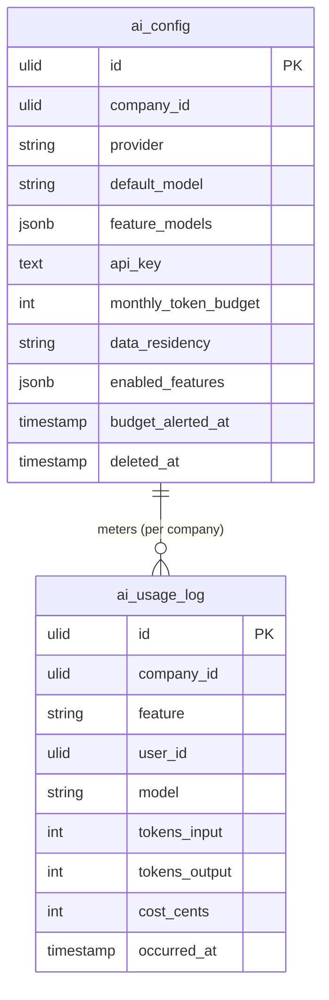

# AI Model Configuration — Data Model

Tables owned: `ai_config`, `ai_usage_log`.

---

## ai_config

One row per company (the provider/budget/toggle settings).

| Column | Type | Constraints | Notes |
|---|---|---|---|
| id | ulid | PK | |
| company_id | ulid | indexed, **unique** | one config per company |
| provider | string | not null | anthropic / openai / azure |
| default_model | string | not null | valid for provider |
| feature_models | jsonb | nullable | per-feature model override map |
| 🔐 api_key | text | encrypted cast | BYO provider key; never re-displayed. See [[../../../architecture/patterns/encryption]] |
| monthly_token_budget | int | nullable | null = no budget cap |
| data_residency | string | default `global` | eu / global |
| enabled_features | jsonb | nullable | which AI features are on |
| budget_alerted_at | timestamp | nullable | guards the once-per-month 80% alert |
| deleted_at | timestamp | nullable | |

---

## ai_usage_log

Append-only usage/cost ledger; pruned at 12 months *(assumed)*.

| Column | Type | Constraints | Notes |
|---|---|---|---|
| id | ulid | PK | |
| company_id | ulid | indexed | |
| feature | string | not null | copilot / document-intelligence / workflows |
| user_id | ulid | nullable | who triggered the call |
| model | string | not null | model actually used |
| tokens_input | int | default 0 | |
| tokens_output | int | default 0 | |
| cost_cents | int | default 0 | integer minor unit — brick/money |
| occurred_at | timestamp | not null | |

Append-only: no updates or soft-deletes; the `LlmGateway` is the sole writer.

---

## ERD

(No hard FK between the two — `ai_usage_log` is scoped by `company_id`, matching the single `ai_config` per company.)
