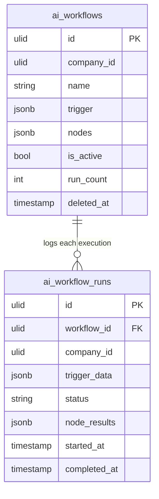

# Workflow Builder — Data Model

Tables owned: `ai_workflows`, `ai_workflow_runs`. Nothing else — every cross-domain effect is a service call, never a foreign write ([[../../../security/data-ownership]]).

---

## ai_workflows

One row per configured automation.

| Column | Type | Constraints | Notes |
|---|---|---|---|
| id | ulid | PK | |
| company_id | ulid | indexed | `BelongsToCompany` + `CompanyScope` |
| name | string | not null | admin-facing label |
| trigger | jsonb | not null | `{ type: event\|schedule, config }` — event key (event-bus map) or cron-ish schedule |
| nodes | jsonb | not null | the graph: condition + action nodes, registry-validated (reachable, no cycles) |
| is_active | bool | default false | enable/disable toggle |
| run_count | int | default 0 | denormalised counter, incremented per run |
| deleted_at | timestamp | nullable | soft delete |

---

## ai_workflow_runs

Append-only execution ledger; one row per trigger instance. Pruned at 90 days *(assumed)*.

| Column | Type | Constraints | Notes |
|---|---|---|---|
| id | ulid | PK | |
| workflow_id | ulid | FK → `ai_workflows.id` | the workflow that ran |
| company_id | ulid | indexed | denormalised for tenant scoping |
| trigger_data | jsonb | not null | the event/schedule payload that fired the run |
| status | string | not null | `running` / `success` / `failed` / `partial` |
| node_results | jsonb | nullable | per-node input/output/error trace |
| started_at | timestamp | not null | |
| completed_at | timestamp | nullable | null while `running` |

`status: partial` = some actions succeeded, others hit a `stop`/`continue` error policy.

---

## ERD

> [!warning] UNVERIFIED
> The 90-day `ai_workflow_runs` prune horizon is assumed. Confirm against the retention policy ([[../../../architecture/data-lifecycle]]) before relying on it.
