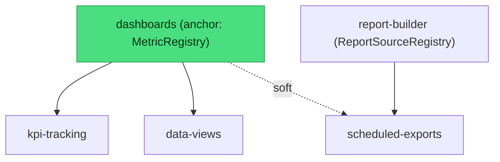
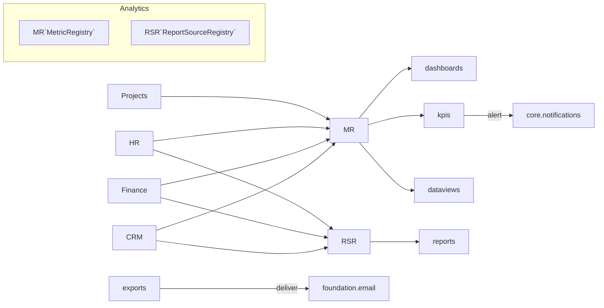

# Analytics & BI — MOC

Custom dashboards, no-code report builder, KPI tracking, cross-domain data views, and scheduled exports. **Panel:** `/analytics` (Sky) — Phase 3, priority p3.

Analytics is a **pure read-consumer**: it owns only its own `bi_*` tables and reads every other domain through two registries — `MetricRegistry` (widgets/KPIs) and `ReportSourceRegistry` (reports, whitelisted columns only). It never writes another domain's tables ([[../../security/data-ownership]]). See [[_opportunities|opportunities]].

---

## Modules

| Module | Key | Owns tables | Kind highlights | Depends on (intra-domain) |
|---|---|---|---|---|
| [[dashboards/_module\|Custom Dashboards]] | `analytics.dashboards` | `bi_dashboards`, `bi_widgets` | dashboard builder custom-page (#6) | — (anchor: ships MetricRegistry) |
| [[report-builder/_module\|Report Builder]] | `analytics.reports` | `bi_reports` | report builder custom-page (#9) + resource | — |
| [[kpi-tracking/_module\|KPI Tracking]] | `analytics.kpis` | `bi_kpis`, `bi_kpi_snapshots` | resource + gauge dashboard (#6) | dashboards |
| [[data-views/_module\|Cross-Domain Data Views]] | `analytics.data-views` | — (none) | gallery (#17) + per-view report render (#9) | dashboards |
| [[scheduled-exports/_module\|Scheduled Exports]] | `analytics.exports` | `bi_export_schedules`, `bi_export_log` | resource + delivery-log relation | reports (+ dashboards soft) |

---

## Dependency Graph (intra-domain)



Build sequence: **dashboards → kpis / data-views / report-builder → scheduled-exports**.

---

## Cross-Domain Read Paths (no events)



Every source domain registers CompanyScope-safe metric closures / whitelisted report sources. Availability follows module activation (`hasModule`). Encrypted/sensitive columns are never registered as reportable. KPI alerts route through `core.notifications`; exports deliver through `foundation.email` — never by writing another domain's tables.

---

## Feature Index

- **Dashboards** — [[dashboards/features/metric-registry|MetricRegistry]] · [[dashboards/features/dashboard-builder|Builder]] · [[dashboards/features/widget-rendering|Widget Rendering]] · [[dashboards/features/dashboard-sharing|Sharing]]
- **Report Builder** — [[report-builder/features/source-registry|Source Registry]] · [[report-builder/features/report-composer|Composer]] · [[report-builder/features/report-runner|Runner]] · [[report-builder/features/saved-reports|Saved Reports]]
- **KPI Tracking** — [[kpi-tracking/features/kpi-definition|Definition]] · [[kpi-tracking/features/snapshot-capture|Snapshot Capture]] · [[kpi-tracking/features/kpi-visualisation|Visualisation]] · [[kpi-tracking/features/threshold-alerts|Threshold Alerts]]
- **Data Views** — [[data-views/features/view-registry|View Registry]] · [[data-views/features/view-explorer|View Explorer]] · [[data-views/features/drill-down|Drill-Down]] · [[data-views/features/view-export|View Export]]
- **Scheduled Exports** — [[scheduled-exports/features/schedule-management|Schedule Management]] · [[scheduled-exports/features/recurring-generation|Recurring Generation]] · [[scheduled-exports/features/delivery-log|Delivery Log]]

---

## Status Board (Dataview)

```dataview
TABLE module AS "Module", status AS "Status", build-status AS "Build"
FROM "domains/analytics"
WHERE type = "module"
SORT module ASC
```

---

## Key Patterns

- `leandrocfe/filament-apex-charts` — all chart widgets + gauges
- `maatwebsite/laravel-excel` + `spatie/laravel-pdf` — reports + exports
- Heavy caching of aggregations ([[../../architecture/caching]], [[../../architecture/performance]])
- CompanyScope on every aggregate path — the report-isolation test is the domain's most important test ([[../../security/data-ownership]])
