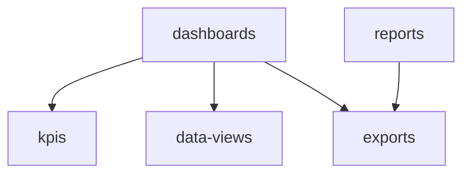

# Analytics & BI

Custom dashboards, report builder, KPI tracking, cross-domain data views, and scheduled exports. **Panel:** `/analytics` (Sky) — Phase 3.

---

## Navigation Groups

- **Dashboards** — Custom Dashboards, Dashboard Builder
- **Reports** — Report Builder, Saved Reports, Scheduled Exports
- **KPIs** — KPI Tracking
- **Data Views** — Cross-Domain Views

---

## Modules

| Module | Key | Status | Priority | Depends on (intra-domain) |
|---|---|---|---|---|
| [[domains/analytics/dashboards\|Custom Dashboards]] | `analytics.dashboards` | planned | p3 | — (anchor: ships MetricRegistry) |
| [[domains/analytics/report-builder\|Report Builder]] | `analytics.reports` | planned | p3 | — |
| [[domains/analytics/kpi-tracking\|KPI Tracking]] | `analytics.kpis` | planned | p3 | dashboards |
| [[domains/analytics/data-views\|Cross-Domain Data Views]] | `analytics.data-views` | planned | p3 | dashboards |
| [[domains/analytics/scheduled-exports\|Scheduled Exports]] | `analytics.exports` | planned | p3 | reports |

## Dependency Graph (intra-domain)



## Cross-Domain Edges

No events. Domains feed analytics via two registries: `MetricRegistry` (widgets/KPIs) and `ReportSourceRegistry` (report builder, whitelisted columns only — sensitive/encrypted fields never reportable). View/metric availability follows module activation.

---

## Status Board (Dataview)

```dataview
TABLE module-key AS "Key", status AS "Status", priority AS "Priority"
FROM "domains/analytics"
WHERE type = "module"
SORT module-key ASC
```

---

## Key Patterns

- `leandrocfe/filament-apex-charts` — all chart widgets
- `maatwebsite/laravel-excel` + `spatie/laravel-pdf` — exports
- Heavy caching of aggregations ([[architecture/caching]], [[architecture/performance]])
- CompanyScope on every aggregate path — report-isolation test is the domain's most important test
