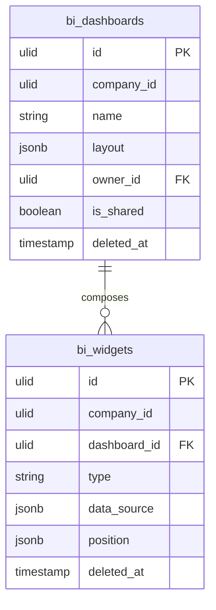

# Custom Dashboards — Data Model

Tables owned: `bi_dashboards`, `bi_widgets`. Analytics owns **only** these two tables; all widget data is read at query time through the [[./features/metric-registry|MetricRegistry]] closures of the owning domains — Analytics never persists another domain's data ([[../../../security/data-ownership]]).

---

## bi_dashboards

| Column | Type | Constraints | Notes |
|---|---|---|---|
| id, company_id (indexed) | ulid | | `BelongsToCompany` |
| name | string | not null | e.g. "Sales Overview" |
| layout | jsonb | not null, default `[]` | grid of widget positions (row/col/w/h per widget) |
| owner_id | ulid | FK users | dashboard creator; owner-only edit |
| is_shared | boolean | default false | shared = team read-only; private = owner-only |
| deleted_at | timestamp | nullable | soft delete |

---

## bi_widgets

| Column | Type | Constraints | Notes |
|---|---|---|---|
| id, company_id (indexed) | ulid | | |
| dashboard_id | ulid | FK bi_dashboards, cascade | parent dashboard |
| type | string | in registry set | stat / line / bar / pie / table / gauge |
| data_source | jsonb | not null, **registry-validated on write** | `{ metric_key, filters }`; unregistered/inactive-module key rejected |
| position | jsonb | not null | `{ row, col, w, h }` within the grid |
| deleted_at | timestamp | nullable | |

> [!warning] UNVERIFIED
> Column-level types (`jsonb` vs `json`), exact `layout`/`position` shape, and whether `position` is denormalised out of `bi_dashboards.layout` or lives only on `bi_widgets` are *(assumed)* — no codebase to confirm. The spec keeps `layout` on the dashboard **and** `position` on each widget; a build pass should pick one source of truth.

---

## ERD

No FK to any other domain's table — cross-domain data arrives only through `MetricRegistry` closures at read time.

---

## DTOs

### CreateDashboardData
- `name` — required
- `is_shared` — boolean

### AddWidgetData
- `dashboard_id` — ulid, own dashboard (owner-only edit *(assumed)*)
- `type` — in the registered widget-type set
- `metric_key` — registered in `MetricRegistry` **and** its module active
- `filters` — validated against the metric definition's allowed filters

DTOs use `spatie/laravel-data` per [[../../../architecture/patterns/dto-pattern]].
