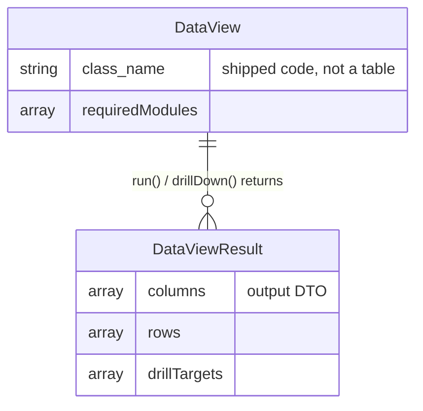

# Cross-Domain Data Views — Data Model

**No persistent tables.** Data views are shipped code (`DataView` classes), not user records. Every result is a query-time aggregation across the **source domains' own read paths**, always company-filtered, cached per `(view, range)`. Analytics persists nothing here and owns no table ([[../../../security/data-ownership]]).

---

## ERD

> No database entities. The diagram documents the in-memory contract, not tables — there is nothing to migrate for this module.

---

## DTOs

### DataViewResult (output only)
- `columns` — ordered column definitions (label, type, format)
- `rows` — aggregated rows
- `drillTargets` — per-row keys enabling `drillDown()`

DTOs use `spatie/laravel-data` per [[../../../architecture/patterns/dto-pattern]].

> [!warning] UNVERIFIED
> The v1 view set, each view's exact aggregate columns, drill-down shape, and the 1 h cache TTL are *(assumed)* — no codebase to confirm. A build pass fixes each view's contract against the real source-domain read APIs.
