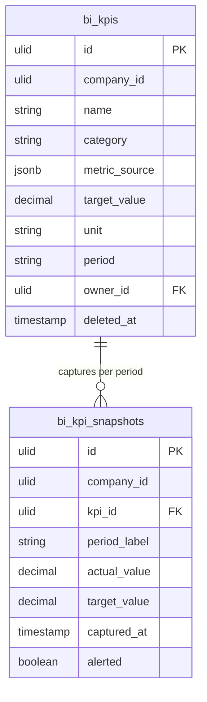

# KPI Tracking — Data Model

Tables owned: `bi_kpis`, `bi_kpi_snapshots`. Metric actuals are read via `MetricRegistry` — no other domain's data is persisted here ([[../../../security/data-ownership]]).

---

## bi_kpis

| Column | Type | Constraints | Notes |
|---|---|---|---|
| id, company_id (indexed) | ulid | | `BelongsToCompany` |
| name | string | not null | |
| category | string | in set | revenue / growth / efficiency / customer |
| metric_source | jsonb | not null | `{ type: metric\|manual, key? }`; metric key must be registered + module active |
| target_value | decimal(16,2) | not null | |
| unit | string | | e.g. €, %, count |
| period | string | in set | monthly / quarterly |
| owner_id | ulid | FK users | |
| deleted_at | timestamp | nullable | soft delete |

---

## bi_kpi_snapshots

| Column | Type | Constraints | Notes |
|---|---|---|---|
| id, company_id (indexed) | ulid | | |
| kpi_id | ulid | FK bi_kpis, cascade | |
| period_label | string | unique per kpi | e.g. `2026-Q2`, `2026-06` |
| actual_value | decimal(16,2) | | resolved or manually entered |
| target_value | decimal(16,2) | | frozen target at capture |
| captured_at | timestamp | | |
| alerted | boolean | default false | once-guard for below-threshold alert |

> [!warning] UNVERIFIED
> `decimal(16,2)` precision, the ±5% status band, and `jsonb` vs `json` for `metric_source` are *(assumed)* — no codebase to confirm.

---

## ERD

No FK to any other domain — metric actuals arrive through `MetricRegistry` closures at capture time.

---

## DTOs

### CreateKpiData
- `name` — required
- `category` — in the category set
- `metric_source` — registered metric key (+ active module) **or** manual
- `target_value`, `unit`, `period` — required

### RecordManualValueData
- `kpi_id` — a manual-source KPI
- `period_label` — the period being recorded
- `actual_value` — required

DTOs use `spatie/laravel-data` per [[../../../architecture/patterns/dto-pattern]].
