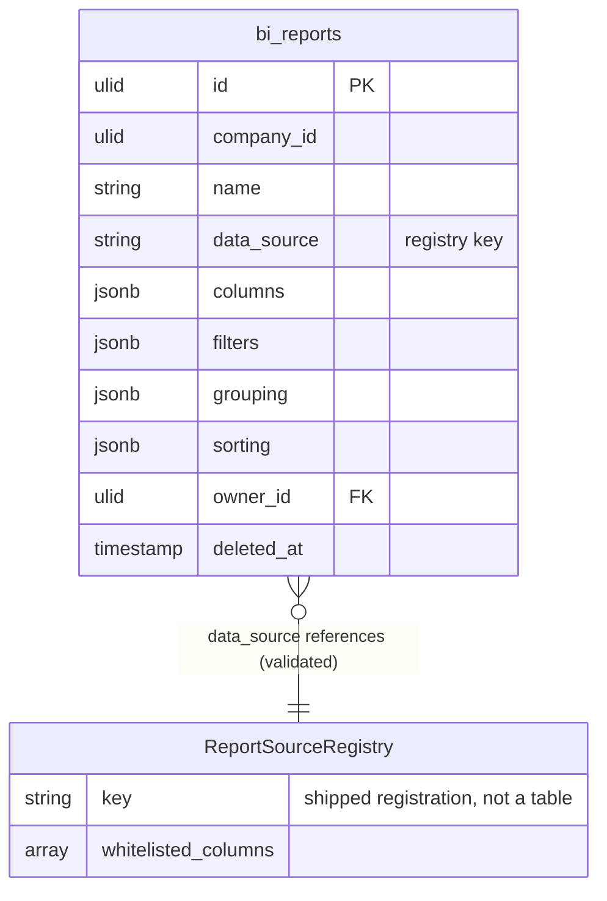

# Report Builder — Data Model

Table owned: `bi_reports` — the saved report **definition** only (source key + column/filter/grouping/sorting config). No source data is copied; every run re-queries the source through the registry ([[../../../security/data-ownership]]).

---

## bi_reports

| Column | Type | Constraints | Notes |
|---|---|---|---|
| id, company_id (indexed) | ulid | | `BelongsToCompany` |
| name | string | not null | |
| data_source | string | registry key, validated | reportable entity key; module must be active |
| columns | jsonb | not null | selected whitelisted columns |
| filters | jsonb | default `[]` | field conditions + AND/OR; operators in set |
| grouping | jsonb | default `[]` | grouped columns (whitelisted) |
| sorting | jsonb | default `[]` | sort columns + direction (whitelisted) |
| owner_id | ulid | FK users | |
| deleted_at | timestamp | nullable | soft delete |

> [!warning] UNVERIFIED
> `jsonb` vs `json`, and whether `columns/filters/grouping/sorting` are separate columns or one `definition` blob, are *(assumed)* — no codebase to confirm. All jsonb config is **registry-validated on write** so a non-whitelisted/sensitive column can never be persisted.

---

## ERD

`data_source` references a registry key (shipped code), **not** a foreign table — no FK to another domain. Source rows are read at run time through the registry's CompanyScope-safe query.

---

## DTOs

### CreateReportData
- `name` — required
- `data_source` — registered source key **and** its module active
- `columns[]` — each in the source's whitelist
- `filters` — operators in the allowed set, fields whitelisted
- `grouping` / `sorting` — whitelisted columns

DTOs use `spatie/laravel-data` per [[../../../architecture/patterns/dto-pattern]].
