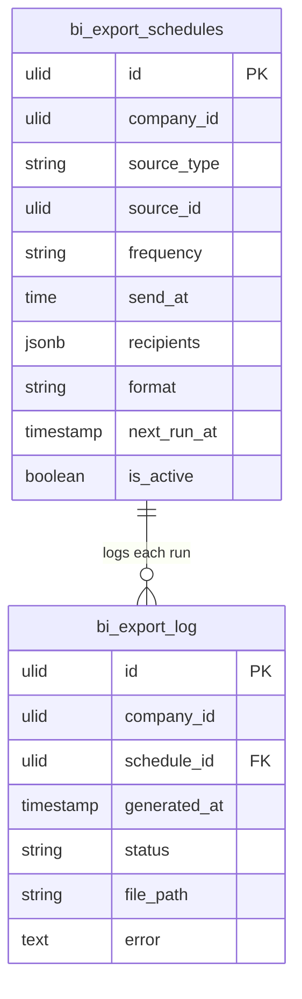

# Scheduled Exports — Data Model

Tables owned: `bi_export_schedules`, `bi_export_log`. The `source_id` references a report/dashboard by id but the export **reads that source through its own domain's read path** — no source data is duplicated here ([[../../../security/data-ownership]]).

---

## bi_export_schedules

| Column | Type | Constraints | Notes |
|---|---|---|---|
| id, company_id (indexed) | ulid | | `BelongsToCompany` |
| source_type | string | in set | report / dashboard / financial |
| source_id | ulid | | id of the source (validated exists + accessible) |
| frequency | string | in set | daily / weekly / monthly |
| send_at | time | | send time (company TZ) |
| recipients | jsonb | not null | company user ids (min 1) |
| format | string | in set | xlsx / pdf |
| next_run_at | timestamp | indexed | advanced transactionally on each run |
| is_active | boolean | default true | pause/resume |

---

## bi_export_log

| Column | Type | Constraints | Notes |
|---|---|---|---|
| id, company_id (indexed) | ulid | | |
| schedule_id | ulid | FK bi_export_schedules, cascade | |
| generated_at | timestamp | | |
| status | string | in set | success / failed |
| file_path | string | nullable | tenant-scoped path (`companies/{id}/exports/`) |
| error | text | nullable | failure reason |

Log rows pruned after 90 days *(assumed)*.

> [!warning] UNVERIFIED
> `time` vs `string` for `send_at`, `jsonb` vs `json`, the 10 MB attach-vs-link threshold, and the 90-day prune window are *(assumed)* — no codebase to confirm.

---

## ERD

`source_id` is a soft reference to a `bi_reports` / `bi_dashboards` row (or a financial statement); the source is read at run time through its domain's read path, not FK-joined into another domain's tables.

---

## DTOs

### CreateScheduleData
- `source` — `{ type, id }`; must exist + be owner-accessible
- `frequency` — in the set
- `send_at` — time (company TZ)
- `recipients[]` — company users, min 1
- `format` — in the set (xlsx/pdf)

DTOs use `spatie/laravel-data` per [[../../../architecture/patterns/dto-pattern]].
