# Communications — MOC

Shared omnichannel inbox (email, WhatsApp, SMS), internal team messaging, broadcast, and automation. **Panel:** `/comms` (Blue) — Phase 2.

Merged from **Omnichannel Inbox** + **Communications** (formerly two domains). **Key differentiator:** native WhatsApp Business API — the #1 HubSpot pain point for EU SMBs ([[../../product/positioning|positioning]]).

Every module is exploded to a folder: `_module` + `architecture` + `data-model`(+ERD) + `api` + `security` + `decisions` + `unknowns` + `features/`. See [[_opportunities]] for researched market gaps.

---

## Modules

| Module | Key | Owns tables | Features |
|---|---|---|---|
| [[shared-inbox/_module\|Shared Inbox]] | `comms.inbox` | channels, conversations, messages | unified-view · driver-registry · collision · snooze |
| [[email-channel/_module\|Email Channel]] | `comms.email` | email_channels | inbound-parsing · outbound-threading |
| [[whatsapp/_module\|WhatsApp]] | `comms.whatsapp` | whatsapp_config, whatsapp_templates | template-mgmt · window-sending · inbound-webhook |
| [[sms-channel/_module\|SMS Channel]] | `comms.sms` | sms_config, sms_optouts | inbound-optout · outbound-send · cost-tracking |
| [[broadcast/_module\|Broadcast]] | `comms.broadcast` | broadcasts, broadcast_recipients | compose-schedule · materialisation · delivery-tracking |
| [[automations/_module\|Automations]] | `comms.automations` | automation_rules, chatbot_flows | auto-reply · routing · chatbot-flows |
| [[internal-messaging/_module\|Internal Messaging]] | `comms.internal` | channels_internal, channel_members, internal_messages | channels-dms · realtime · threads-reactions |
| [[comms-analytics/_module\|Comms Analytics]] | `comms.analytics` | **none** (read-only) | response-time · agent-perf · channel-mix |

Build order: inbox → email → whatsapp → broadcast → sms → automations → internal → analytics.

---

## Intra-domain Graph

```mermaid
graph TD
    inbox["Shared Inbox<br/>(driver registry)"]
    email[Email Channel]
    wa[WhatsApp]
    sms[SMS Channel]
    bc[Broadcast]
    auto[Automations]
    an[Comms Analytics]
    im["Internal Messaging<br/>(standalone)"]

    email -->|registers driver| inbox
    wa -->|registers driver| inbox
    sms -->|registers driver| inbox
    auto -->|hooks inbound| inbox
    bc -->|sends via drivers| inbox
    an -.read-only.-> inbox
    an -.read-only.-> bc
    wa -.template broadcast.-> bc
    sms -.opt-out check.-> bc

    im -.->|core.notifications| notif((core.notifications))

    classDef standalone fill:#1e293b,stroke:#4ADE80;
    class im standalone;
```

---

## Cross-Domain Edges (data-ownership)

- **No cross-domain domain-events** are fired or consumed by any comms module (all `fires-events: []` / `consumes-events: []`).
- **Reads only** into other domains: inbox ← `crm.contacts` (auto-link); broadcast ← `crm.segments` + `hr.profiles` (audiences).
- **Reactions written by the reacting domain**: `@mention` in internal-messaging → `core.notifications` writes its own rows.
- **Single-owner rule holds**: channel modules never write `comms_messages` (inbox-owned); automations mutate conversations via `InboxService`; analytics owns no tables. Every write stays inside the owning module ([[../../security/data-ownership]]).

Realtime: Shared Inbox + Internal Messaging are heavy Reverb consumers (ui-strategy row #8). `MessageReceived` / `InternalMessagePosted` are **broadcast** events, not bus events.

---

## Key Patterns

- `ChannelDriver` contract — inbox stays channel-agnostic; channels register drivers in their providers.
- [[../../architecture/websockets]] — live message arrival + collision whispers (heavy use).
- Custom pages — Shared Inbox (3-panel #8), Internal Messaging (#8), analytics dashboards.
- Encrypted channel credentials (API keys, OAuth, webhook secrets) — [[../../architecture/patterns/encryption]].
- `propaganistas/laravel-phone` — WhatsApp + SMS numbers in E.164.
- Provider webhooks signature-verified + rate-limited before processing — [[../../architecture/security]].
- **Build-time ADR required**: WhatsApp provider (360dialog / Twilio / Meta direct) — see [[whatsapp/decisions]].

## Related

- [[_opportunities]] · [[../../product/positioning]] · [[../../security/data-ownership]] · [[../_overview|Domains overview]]
