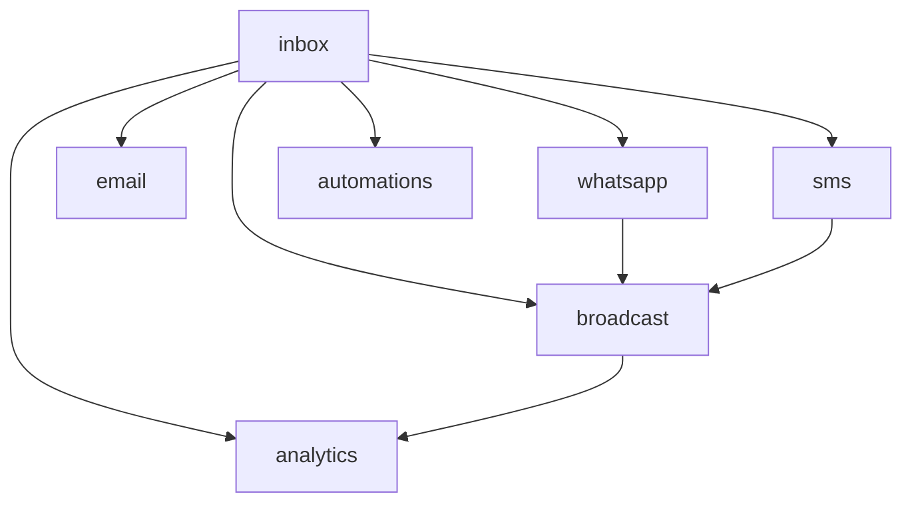

# Communications

Shared omnichannel inbox (email, WhatsApp, SMS), internal messaging, broadcast, and automation. **Panel:** `/comms` (Blue) — Phase 2 (M8 in [[build/ROADMAP]]).

Merged from: **Omnichannel Inbox** + **Communications** (formerly two separate domains)

**Key differentiator**: Native WhatsApp Business API — the #1 HubSpot pain point for EU SMBs (see [[product/positioning]]).

---

## Navigation Groups

- **Inbox** — Shared Inbox
- **Broadcast** — Broadcasts
- **Messaging** — Internal Messaging
- **Analytics** — Comms Dashboard
- **Settings** — Channels (Email, SMS, WhatsApp), Automations

---

## Modules

| Module | Key | Status | Priority | Depends on (intra-domain) |
|---|---|---|---|---|
| [[domains/communications/shared-inbox\|Shared Inbox]] | `comms.inbox` | planned | p2 | — (anchor + driver registry) |
| [[domains/communications/whatsapp\|WhatsApp]] | `comms.whatsapp` | planned | p2 | inbox |
| [[domains/communications/email-channel\|Email Channel]] | `comms.email` | planned | p2 | inbox |
| [[domains/communications/sms-channel\|SMS Channel]] | `comms.sms` | planned | p2 | inbox |
| [[domains/communications/broadcast\|Broadcast]] | `comms.broadcast` | planned | p2 | inbox |
| [[domains/communications/automations\|Automations]] | `comms.automations` | planned | p2 | inbox |
| [[domains/communications/internal-messaging\|Internal Messaging]] | `comms.internal` | planned | p2 | — |
| [[domains/communications/comms-analytics\|Comms Analytics]] | `comms.analytics` | planned | p2 | inbox |

Build order: inbox → email → whatsapp → broadcast → sms → automations → internal → analytics.

## Dependency Graph (intra-domain)



## Cross-Domain Edges

No domain events. Soft links: CRM contacts auto-linking, CRM segments + HR groups as broadcast audiences. Inbox/internal-messaging are heavy Reverb consumers (ui-strategy row #8).

---

## Status Board (Dataview)

```dataview
TABLE module-key AS "Key", status AS "Status", priority AS "Priority"
FROM "domains/communications"
WHERE type = "module"
SORT module-key ASC
```

---

## Key Patterns

- `ChannelDriver` contract — inbox stays channel-agnostic; each channel module registers a driver
- [[architecture/websockets]] — real-time message arrival (heavy use)
- Custom pages — Shared Inbox (3-panel #8), Internal Messaging (#8), dashboards
- Encrypted channel credentials (API keys, OAuth tokens) — [[architecture/patterns/encryption]]
- `propaganistas/laravel-phone` — WhatsApp + SMS numbers in E.164
- Provider webhooks verified before processing — [[architecture/security]]
- **Build-time ADR required**: WhatsApp provider (360dialog / Twilio / Meta direct)
