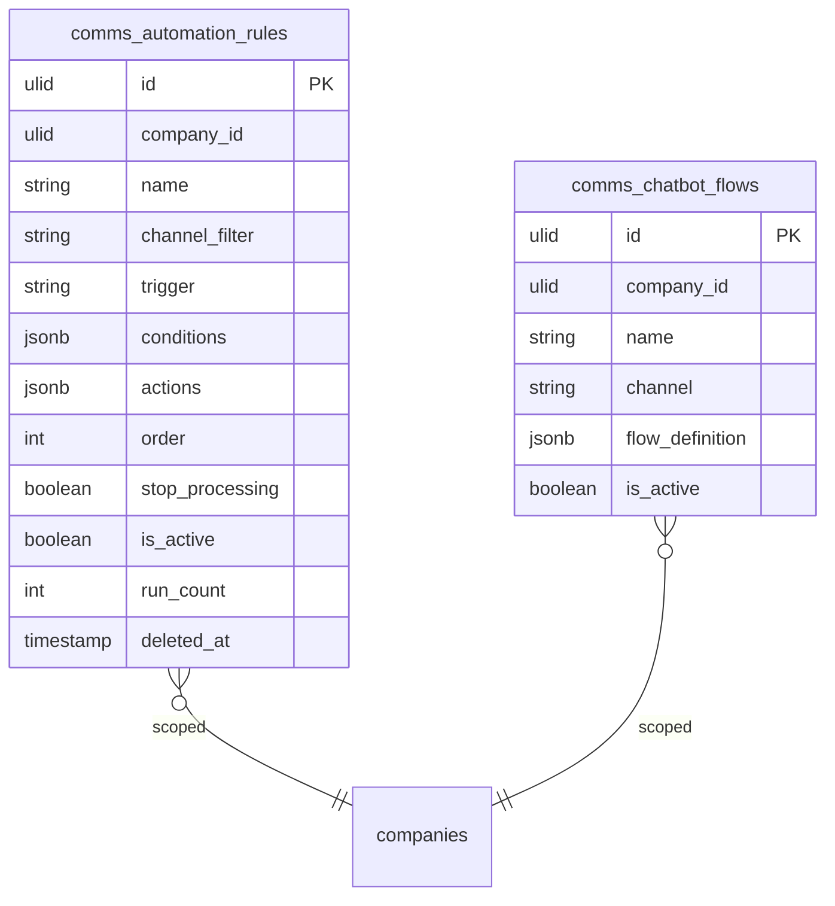

# Automations — Data Model

## `comms_automation_rules`

| Column | Type | Notes |
|---|---|---|
| `id` | ulid | PK |
| `company_id` | ulid | Indexed, `BelongsToCompany` |
| `name` | string | |
| `channel_filter` | string nullable | channel type or null = all |
| `trigger` | string | inbound-message / conversation-created / outside-hours |
| `conditions` | jsonb | AND rules, registry-validated |
| `actions` | jsonb | typed action configs |
| `order` | int | execution order |
| `stop_processing` | boolean | default false |
| `is_active` | boolean | default true |
| `run_count` | int | default 0 — in-rule counter |
| `deleted_at` | timestamp nullable | Soft delete |

## `comms_chatbot_flows`

| Column | Type | Notes |
|---|---|---|
| `id` | ulid | PK |
| `company_id` | ulid | Indexed |
| `name` | string | |
| `channel` | string | |
| `flow_definition` | jsonb | nodes: `{id, message, options: [{match, next/action}]}` |
| `is_active` | boolean | one active flow per channel *(assumed)* |

Chatbot flow position per conversation is held in `comms_conversations` meta *(assumed jsonb meta column, owned by the inbox)*.

## ERD

No separate execution-log table — counters (`run_count`) + `spatie/laravel-activitylog` *(assumed)*.

## Related

- [[_module]] · [[architecture]]
