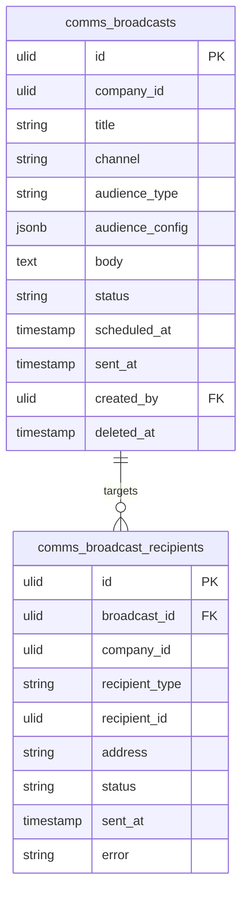

# Broadcast — Data Model

## `comms_broadcasts`

| Column | Type | Notes |
|---|---|---|
| `id` | ulid | PK |
| `company_id` | ulid | Indexed, `BelongsToCompany` |
| `title` | string | |
| `channel` | string | email / whatsapp / sms / in-app |
| `audience_type` | string | segment / employee-group / manual |
| `audience_config` | jsonb | segment_id / department_ids / recipient list |
| `body` | text | purified; `template_id` for whatsapp |
| `status` | string | default `draft` — state machine |
| `scheduled_at` | timestamp nullable | |
| `sent_at` | timestamp nullable | |
| `created_by` | ulid | FK → `users` |
| `deleted_at` | timestamp nullable | Soft delete |

## `comms_broadcast_recipients`

| Column | Type | Notes |
|---|---|---|
| `id` | ulid | PK |
| `broadcast_id` | ulid | FK → `comms_broadcasts` |
| `company_id` | ulid | Indexed |
| `recipient_type` | string | contact / employee / manual |
| `recipient_id` | ulid nullable | source id |
| `address` | string | email/phone snapshot |
| `status` | string | default `pending` — pending / sent / delivered / opened / failed |
| `sent_at` | timestamp nullable | |
| `error` | string nullable | |

Unique `(broadcast_id, address)` — duplicate-recipient guard.

## ERD

Recipient rows are a **snapshot** owned by this module — sourced from CRM segments / HR groups / manual lists (read-only), never a live FK into those domains.

## Related

- [[_module]] · [[architecture]] · [[../../../architecture/patterns/states]]
