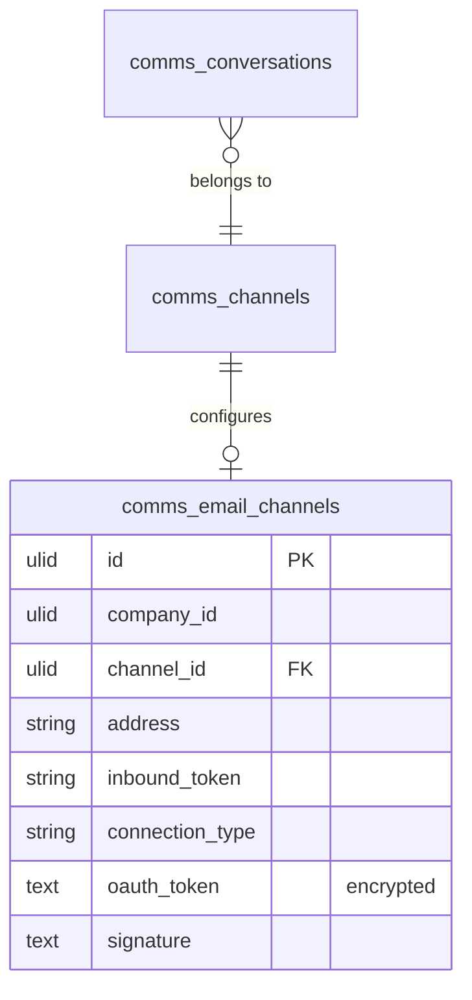

# Email Channel — Data Model

> Message rows live in `comms_messages` (owned by [[../shared-inbox/_module|comms.inbox]]). This module owns only the channel config row.

## `comms_email_channels`

| Column | Type | Notes |
|---|---|---|
| `id` | ulid | PK |
| `company_id` | ulid | Indexed, `BelongsToCompany` |
| `channel_id` | ulid | FK → `comms_channels` |
| `address` | string | Public address (support@company.com) |
| `inbound_token` | string | unique — forwarding address token (`{token}@inbound.flowflex.io`) |
| `connection_type` | string | forward / oauth (v1.x) |
| 🔐 `oauth_token` | text nullable | encrypted cast (v1.x) |
| `signature` | text nullable | purified HTML |

## ERD

Inbound emails become `comms_conversations` + `comms_messages` rows via the inbox — owned there, not here.

## Related

- [[_module]] · [[architecture]] · [[../shared-inbox/data-model]] · [[../../../architecture/patterns/encryption]]
