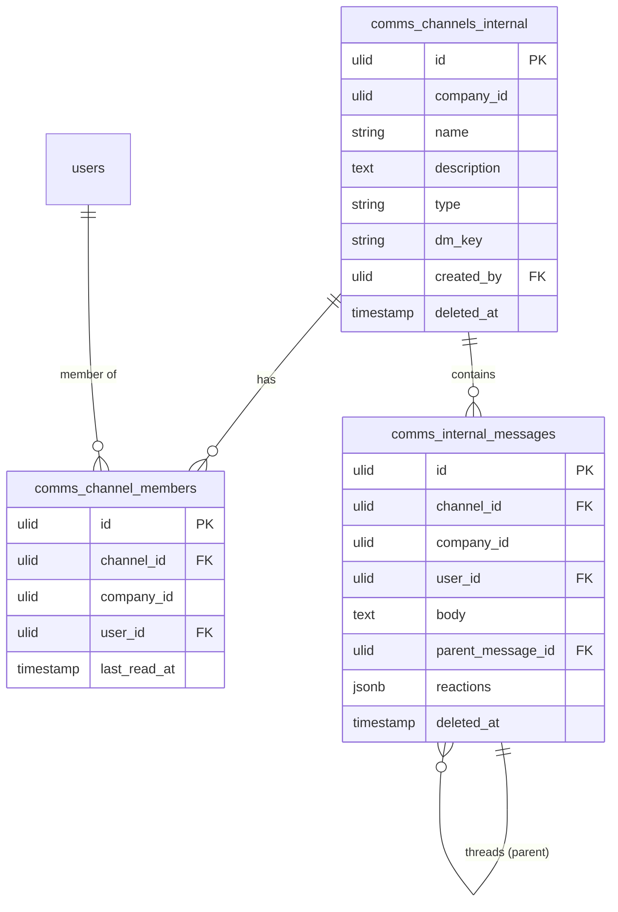

# Internal Messaging — Data Model

## `comms_channels_internal`

| Column | Type | Notes |
|---|---|---|
| `id` | ulid | PK |
| `company_id` | ulid | Indexed, `BelongsToCompany` |
| `name` | string nullable | null for DMs |
| `description` | text nullable | |
| `type` | string | dm / public / private |
| `dm_key` | string nullable | unique — sorted user-id pair hash (DM dedupe) |
| `created_by` | ulid | FK → `users` |
| `deleted_at` | timestamp nullable | Soft delete |

## `comms_channel_members`

| Column | Type | Notes |
|---|---|---|
| `id` | ulid | PK |
| `channel_id` | ulid | FK → `comms_channels_internal` |
| `company_id` | ulid | Indexed |
| `user_id` | ulid | FK → `users` |
| `last_read_at` | timestamp nullable | unread cursor |

Unique `(channel_id, user_id)`.

## `comms_internal_messages`

| Column | Type | Notes |
|---|---|---|
| `id` | ulid | PK |
| `channel_id` | ulid | FK → `comms_channels_internal` |
| `company_id` | ulid | Indexed |
| `user_id` | ulid | FK → `users` (author) |
| `body` | text | purified, max 4000 |
| `parent_message_id` | ulid nullable | FK self — threads |
| `reactions` | jsonb | default `{}` — `{emoji: [user_ids]}` |
| `deleted_at` | timestamp nullable | Soft delete |

**Indexes:** `(channel_id, created_at)` (cursor-paginated feed).

## ERD

## Related

- [[_module]] · [[architecture]]
