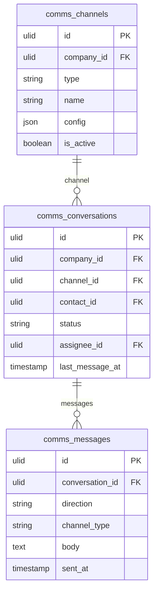

# Shared Inbox

Unified team inbox aggregating email, WhatsApp, SMS, Instagram, and Facebook messages into one conversation view. Team members collaborate on replies. The hub of the Communications domain.

## Core Features

- Unified conversation list across all connected channels
- Conversation = thread of messages with one contact across one channel
- Assignment: assign conversation to a team member
- Status: open / pending / resolved / snoozed
- Internal notes on conversations (not sent to customer)
- Collision detection: warn when another agent is replying to the same conversation
- Channel badges: visual indicator of source channel per conversation
- Contact linking: auto-link to CRM contact by email/phone
- Conversation tags via spatie/laravel-tags
- Search across all conversations (Meilisearch)
- Snooze a conversation until a later time

## Data Model

| Table | Key Columns |
|---|---|
| `comms_conversations` | company_id, channel_id, contact_id, subject, status, assignee_id, last_message_at, snoozed_until |
| `comms_messages` | company_id, conversation_id, direction (inbound/outbound), channel_type, body, sender, sent_at, external_id |
| `comms_channels` | company_id, type (email/whatsapp/sms/instagram/facebook), name, config (json), is_active |

## Filament

**Nav group:** Inbox

- `SharedInboxPage` (custom page) — three-panel: channel/status filter / conversation list / message thread
- Real-time new message arrival via Reverb WebSocket
- Reply composer supports per-channel formatting (WhatsApp templates, plain SMS, rich email)

## Cross-Domain / Infra

- Heavy [[architecture/websockets]] use (live message arrival)
- New conversations create/link CRM contacts

## Related

- [[domains/communications/whatsapp]]
- [[domains/communications/email-channel]]
- [[domains/communications/sms-channel]]
- [[domains/crm/contacts]]
