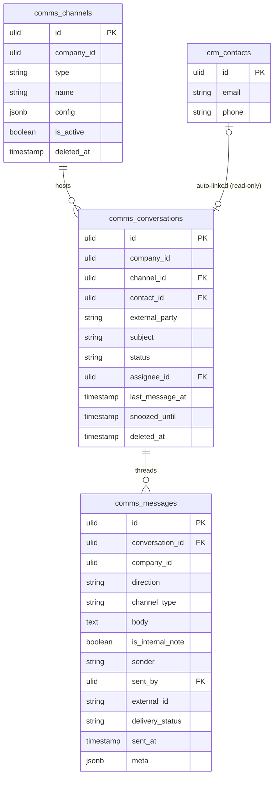

# Shared Inbox — Data Model

## `comms_channels`

| Column | Type | Notes |
|---|---|---|
| `id` | ulid | PK |
| `company_id` | ulid | Indexed, `BelongsToCompany` |
| `type` | string | email / whatsapp / sms (extensible) |
| `name` | string | Display |
| `config` | jsonb | Non-secret channel meta (secrets live in channel-module tables) |
| `is_active` | boolean | |
| `deleted_at` | timestamp nullable | Soft delete |

## `comms_conversations`

| Column | Type | Notes |
|---|---|---|
| `id` | ulid | PK |
| `company_id` | ulid | Indexed, `BelongsToCompany` |
| `channel_id` | ulid | FK → `comms_channels` |
| `contact_id` | ulid nullable | CRM link (soft, read-only auto-link) |
| `external_party` | string | Email / phone of the counterpart |
| `subject` | string nullable | Email only |
| `status` | string | default `open` — open / pending / resolved / snoozed |
| `assignee_id` | ulid nullable | FK → `users` |
| `last_message_at` | timestamp | List sort |
| `snoozed_until` | timestamp nullable | Auto-reopen cursor |
| `deleted_at` | timestamp nullable | Soft delete |

**Indexes:** `(company_id, status, last_message_at)`, `(company_id, assignee_id, status)`, `(company_id, channel_id, external_party)` (threading).

## `comms_messages`

| Column | Type | Notes |
|---|---|---|
| `id` | ulid | PK |
| `conversation_id` | ulid | FK → `comms_conversations` |
| `company_id` | ulid | Indexed, `BelongsToCompany` |
| `direction` | string | inbound / outbound |
| `channel_type` | string | Denormalised from the channel |
| `body` | text | HTML purified before storage |
| `is_internal_note` | boolean | default `false` — team-only, never sent through a driver |
| `sender` | string | Address / agent name |
| `sent_by` | ulid nullable | FK → `users` (outbound agent) |
| `external_id` | string nullable | Provider id; unique `(conversation_id, external_id)` for dedupe |
| `delivery_status` | string nullable | sent / delivered / read / failed |
| `sent_at` | timestamp | |
| `meta` | jsonb nullable | *(assumed)* — provider metadata incl. `cost_cents`; see [[unknowns]] |

**GDPR:** conversations of erased contacts are unlinked, bodies retained as company records per [[../../../architecture/data-lifecycle]] *(assumed)*.

## ERD

