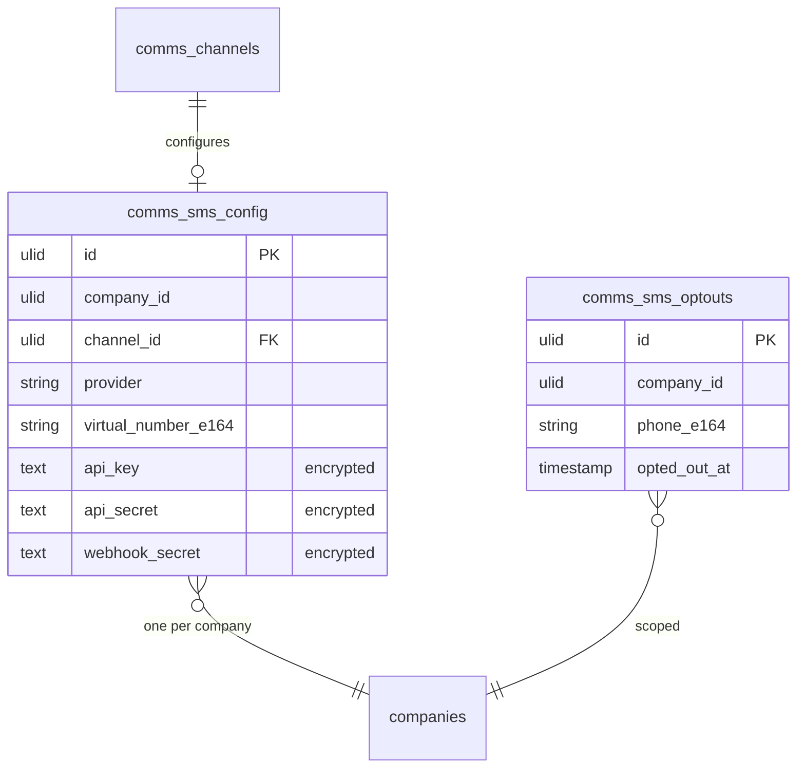

# SMS Channel — Data Model

> Message rows live in `comms_messages` (owned by [[../shared-inbox/_module|comms.inbox]]); `cost_cents` rides in that table's `meta` jsonb *(assumed)*. This module owns config + opt-outs only.

## `comms_sms_config`

| Column | Type | Notes |
|---|---|---|
| `id` | ulid | PK |
| `company_id` | ulid | Indexed, unique — one number v1 *(assumed)* |
| `channel_id` | ulid | FK → `comms_channels` |
| `provider` | string | twilio / vonage |
| `virtual_number_e164` | string | E.164 |
| 🔐 `api_key` | text | encrypted cast |
| 🔐 `api_secret` | text | encrypted cast |
| 🔐 `webhook_secret` | text | encrypted cast — callback verification |

## `comms_sms_optouts`

| Column | Type | Notes |
|---|---|---|
| `id` | ulid | PK |
| `company_id` | ulid | Indexed, `BelongsToCompany` |
| `phone_e164` | string | unique per company |
| `opted_out_at` | timestamp | when STOP received |

## ERD

## Related

- [[_module]] · [[architecture]] · [[../shared-inbox/data-model]] · [[../../../architecture/patterns/encryption]]
