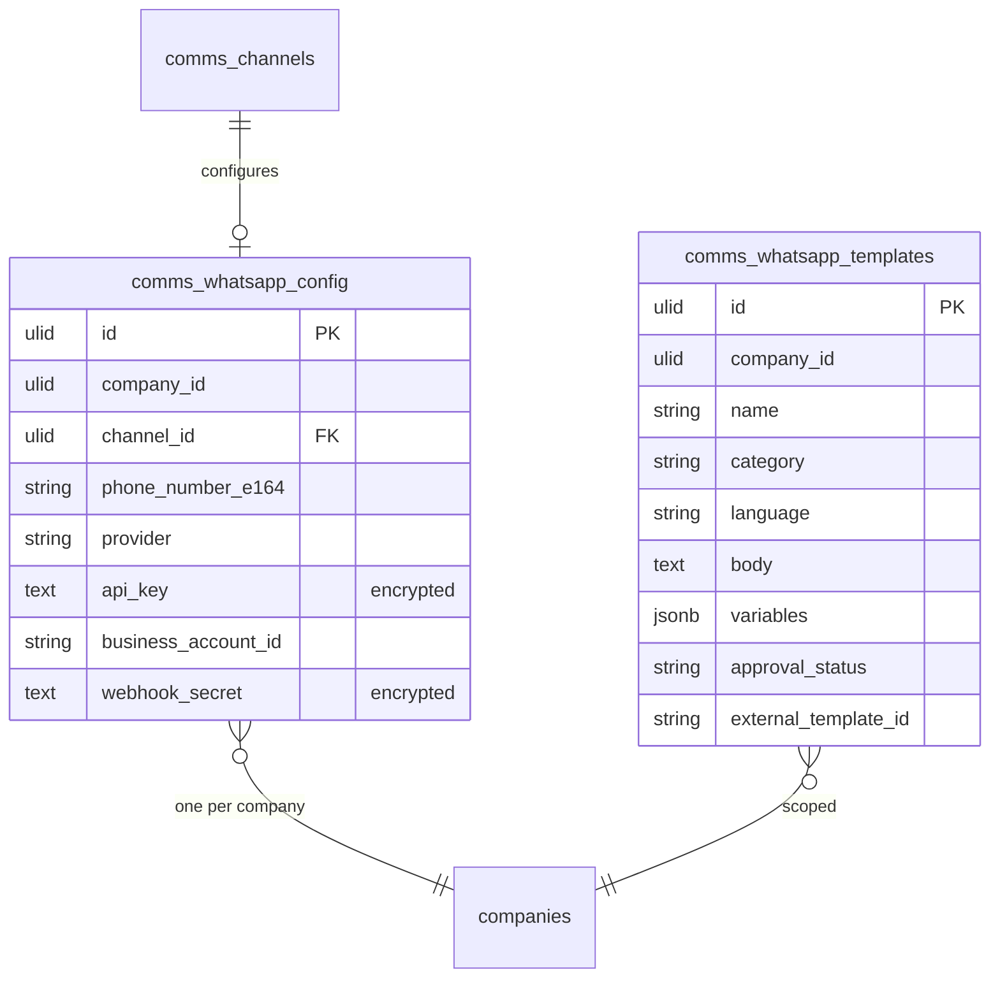

# WhatsApp — Data Model

> Message rows are **not** owned here — they live in `comms_messages` (owned by [[../shared-inbox/_module|comms.inbox]]). This module owns only config + templates.

## `comms_whatsapp_config`

| Column | Type | Notes |
|---|---|---|
| `id` | ulid | PK |
| `company_id` | ulid | Indexed, unique — one config per company *(assumed: one number v1)* |
| `channel_id` | ulid | FK → `comms_channels` |
| `phone_number_e164` | string | E.164 via `propaganistas/laravel-phone` |
| `provider` | string | 360dialog / twilio / meta |
| 🔐 `api_key` | text | encrypted cast |
| `business_account_id` | string | |
| 🔐 `webhook_secret` | text | encrypted cast — provider verify token |

## `comms_whatsapp_templates`

| Column | Type | Notes |
|---|---|---|
| `id` | ulid | PK |
| `company_id` | ulid | Indexed, `BelongsToCompany` |
| `name` | string | provider naming rules (lowercase_underscore) |
| `category` | string | marketing / utility / authentication |
| `language` | string | |
| `body` | text | with `{{n}}` placeholders |
| `variables` | jsonb | sample values |
| `approval_status` | string | default `draft` — draft / pending / approved / rejected |
| `external_template_id` | string nullable | provider id (sync key) |

## ERD

Messages flow through `comms_messages` (`channel_type = whatsapp`) — owned by the inbox, not this module.

## Related

- [[_module]] · [[architecture]] · [[../shared-inbox/data-model]] · [[../../../architecture/patterns/encryption]]
