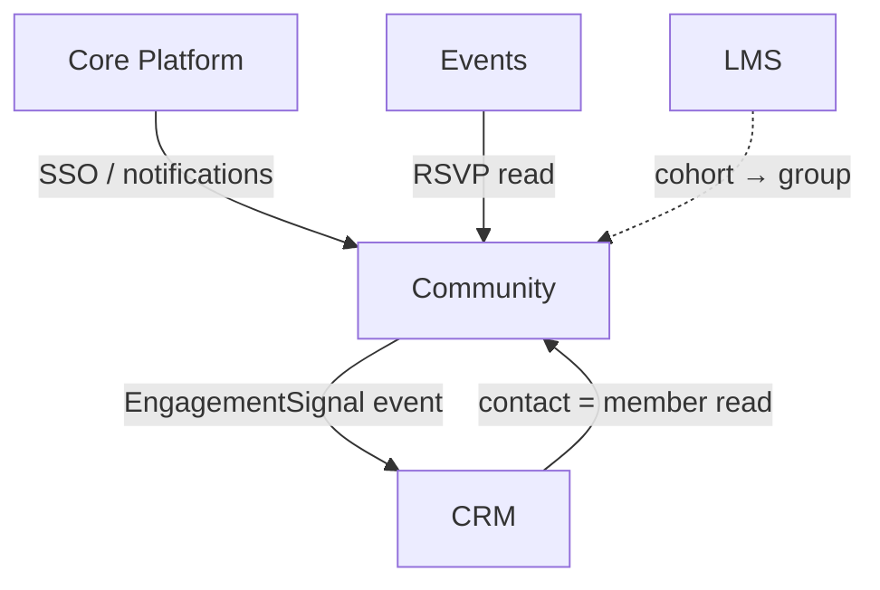

# Community & Social

External-community layer: forums, member directory, groups, badges, and moderation so a company can
build a branded community around its product. Replaces Circle / Discourse / Bettermode at the SMB tier,
hosted inside the same FlowFlex tenant so members, SSO, and events are shared with the rest of the suite.

**Why deferred:** no concrete customer demand yet, and it only earns its keep once a company has a
product with an audience to gather. Explode fully when a customer requests an external community.

## Intended Modules *(assumed — no prior spec)*

| Module | Key | One-line purpose | UI kind guess |
|---|---|---|---|
| Spaces & Forums | community.spaces | Topic spaces, threaded discussion, posts + replies | custom Filament page (feed) + Vue portal |
| Member Directory | community.members | Public/member profiles, roles, join requests | Filament resource + Vue portal |
| Groups | community.groups | Sub-communities / private groups with own membership | Filament resource |
| Moderation | community.moderation | Report queue, flags, bans, content review workflow | custom Filament page (queue) |
| Gamification | community.gamification | Badges, points, levels, leaderboards | Filament resource + widget |
| Community Events | community.events | Meetups / calls tied to member RSVPs | Filament resource (reads Events) |
| Notifications & Digest | community.digest | Activity emails, weekly digest, @mentions | background/none |
| Embed & Portal | community.portal | Public-facing community site + SSO embed | Vue/Inertia (portal) |

## Cross-Domain Relations

| Direction | Counterpart domain | Coupling |
|---|---|---|
| consumes | Core (identity/SSO, files, notifications) | read + event |
| consumes | Events | read (attendee = member) |
| consumes | CRM | read (contact ↔ member link) |
| feeds | CRM | event (community engagement signal) |
| consumes | LMS | read (course cohort → group) |

Full explosion into module/feature notes (with per-feature `## UI` + `## Relations`) happens when this
domain leaves `build-status: deferred`.
