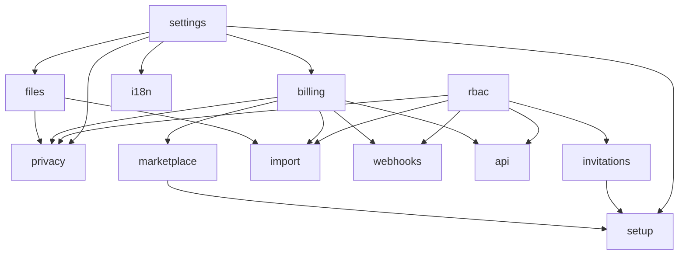

# Core Platform

Cross-cutting features included with every FlowFlex subscription — always active, no extra billing (the always-free set) plus platform utilities. Audit log, notifications, billing engine, module marketplace, company settings, and supporting infrastructure. All other domains depend on at least one Core module. Milestones M1–M2 in [[build/ROADMAP]].

**Panel:** `/app` (Slate)

---

## Modules

| Module | Key | Status | Priority | Depends on (intra-domain) |
|---|---|---|---|---|
| [[domains/core/company-settings\|Company Settings]] | `core.settings` | planned | v1-core | — |
| [[domains/core/rbac\|Roles & Permissions]] | `core.rbac` | planned | v1-core | — |
| [[domains/core/invitation-system\|Invitation System]] | `core.invitations` | planned | v1-core | rbac |
| [[domains/core/billing-engine\|Billing Engine]] | `core.billing` | planned | v1-core | settings |
| [[domains/core/module-marketplace\|Module Marketplace]] | `core.marketplace` | planned | v1-core | billing |
| [[domains/core/audit-log\|Audit Log]] | `core.audit` | planned | v1-core | — |
| [[domains/core/notifications\|Notifications]] | `core.notifications` | planned | v1-core | — |
| [[domains/core/file-storage\|File Storage]] | `core.files` | planned | v1-core | settings |
| [[domains/core/data-import\|Data Import]] | `core.import` | planned | v1 | files, billing, rbac |
| [[domains/core/webhooks\|Webhooks]] | `core.webhooks` | planned | v1 | billing, rbac |
| [[domains/core/api-clients\|API Clients]] | `core.api` | planned | v1 | rbac, billing |
| [[domains/core/setup-wizard\|Setup Wizard]] | `core.setup` | planned | v1 | settings, invitations, marketplace |
| [[domains/core/data-privacy\|Data Privacy]] | `core.privacy` | planned | v1 | settings, files, rbac, billing |
| [[domains/core/i18n\|Internationalisation]] | `core.i18n` | planned | v1 | settings |
| [[domains/core/health-monitoring\|Health Monitoring]] | `core.health` | planned | v1 | — |

Build order within Core: [[build/BUILD-ORDER]] (settings → rbac → invitations → billing → marketplace → audit → notifications → files → rest).

## Dependency Graph (intra-domain)



## Cross-Domain Edges

| Direction | Event | Counterpart |
|---|---|---|
| Fires | `ModuleActivated` (core.billing) | Notifications; Analytics (P3) |
| Fires | `CompanySubscriptionSuspended` (core.billing) | Notifications |
| Fires | `DSARRequestSubmitted` (core.privacy) | Notifications; Legal (P3) |
| Consumes | the above | core.notifications |

---

## Status Board (Dataview)

```dataview
TABLE module-key AS "Key", status AS "Status", priority AS "Priority"
FROM "domains/core"
WHERE type = "module"
SORT priority ASC, module-key ASC
```

---

## Absorbed Domains

**Subscription Billing** (formerly standalone) — billing features live in [[domains/core/billing-engine]].

---

## Conventions

- Always-free core modules cannot be deactivated: auth, notifications, audit, files, rbac, settings, marketplace
- No domain may write directly to `activity_log` — must call `AuditLogger::log()`
- Company Settings is the source of truth for locale, timezone, currency, branding — all other modules read from it
- `BillingService::hasModule(string $key)` is the single gating check for every optional module

## Related Patterns

- [[architecture/auth-rbac]]
- [[architecture/module-system]]
- [[architecture/data-model]]
- [[product/pricing-model]]
