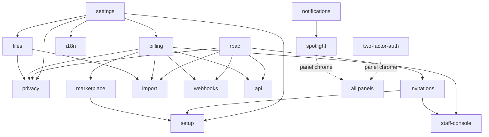

# Core Platform

Cross-cutting platform features included with every FlowFlex subscription — the always-free set (billing, RBAC, settings, notifications, audit, files, marketplace, invitations) plus supporting utilities and platform-wide chrome (2FA, spotlight, staff console). Every other domain depends on at least one Core module. Milestones M1–M2 in [[../../build/ROADMAP]].

**Panel:** `/app` (Slate) · staff surfaces in `/admin` · 2FA + spotlight span all panels.

**Post-login landing:** tenant users arrive at the [[workspace-hub/_module|Workspace Hub]] (domain selector) before entering a domain — see [[../../decisions/decision-2026-06-20-workspace-hub-and-login-model]].

Each module below is a **folder** (`<slug>/_module.md` + sibling notes: `architecture`, `data-model`, `api`, `security`, `decisions`, `unknowns`, `features/`). Start at any `_module` note.

---

## Modules

| Module | Key | Build | Priority | Depends on (intra-domain) |
|---|---|---|---|---|
| [[company-settings/_module\|Company Settings]] | `core.settings` | planned | v1-core | — |
| [[rbac/_module\|Roles & Permissions]] | `core.rbac` | planned | v1-core | — |
| [[invitation-system/_module\|Invitation System]] | `core.invitations` | planned | v1-core | rbac |
| [[billing-engine/_module\|Billing Engine]] | `core.billing` | planned | v1-core | settings |
| [[module-marketplace/_module\|Module Marketplace]] | `core.marketplace` | planned | v1-core | billing |
| [[staff-console/_module\|Staff Console]] | `core.staff-console` | planned | v1-core | billing, invitations |
| [[workspace-hub/_module\|Workspace Hub]] | `core.hub` *(assumed)* | planned | v1-core | billing, rbac |
| [[audit-log/_module\|Audit Log]] | `core.audit` | planned | v1-core | — |
| [[notifications/_module\|Notifications]] | `core.notifications` | planned | v1-core | — |
| [[file-storage/_module\|File Storage]] | `core.files` | planned | v1-core | settings |
| [[two-factor-auth/_module\|Two-Factor Auth]] | `core.2fa` *(assumed)* | planned | v1-core | — |
| [[spotlight/_module\|Spotlight ⌘K]] | `core.spotlight` *(assumed)* | planned | v1-core | notifications |
| [[data-import/_module\|Data Import]] | `core.import` | planned | v1 | files, billing, rbac |
| [[webhooks/_module\|Webhooks]] | `core.webhooks` | planned | v1 | billing, rbac |
| [[api-clients/_module\|API Clients]] | `core.api` | planned | v1 | rbac, billing |
| [[setup-wizard/_module\|Setup Wizard]] | `core.setup` | planned | v1 | settings, invitations, marketplace |
| [[data-privacy/_module\|Data Privacy]] | `core.privacy` | planned | v1 | settings, files, rbac, billing |
| [[i18n/_module\|Internationalisation]] | `core.i18n` | planned | v1 | settings |
| [[health-monitoring/_module\|Health Monitoring]] | `core.health` | planned | v1 | — |

> [!note] Two-factor-auth and spotlight were reconstructed from code (no flat spec existed). Their `core.2fa` / `core.spotlight` module-keys and priorities are `*(assumed)*` — see each module's `unknowns` note.

Build order within Core: [[../../build/BUILD-ORDER]] (settings → rbac → invitations → billing → marketplace → audit → notifications → files → rest).

---

## Dependency Graph (intra-domain)



## Cross-Domain Edges

| Direction | Event | Counterpart |
|---|---|---|
| Fires | `ModuleActivated` (core.billing) | Notifications; Analytics (P3) |
| Fires | `CompanySubscriptionSuspended` (core.billing) | Notifications |
| Fires | `DSARRequestSubmitted` (core.privacy) | Notifications; Legal (P3) |
| Consumes | `ModuleActivated`, `CompanySubscriptionSuspended`, `DSARRequestSubmitted` | core.notifications |

> [!warning] UNVERIFIED — needs confirmation: notifications' `NotifyDsarSubmittedListener` was NOT built, so `DSARRequestSubmitted` currently fires without a notifications consumer. See [[notifications/unknowns]] and [[data-privacy/unknowns]].

---

## Status Board (Dataview)

```dataview
TABLE module AS "Module", build-status AS "Build", status AS "Status"
FROM "domains/core"
WHERE type = "module"
SORT module ASC
```

---

## Absorbed Domains

**Subscription Billing** (formerly standalone) — billing features live in [[billing-engine/_module]].

---

## Conventions

- Always-free core modules cannot be deactivated: 2fa, notifications, audit, files, rbac, settings, marketplace, invitations.
- No domain may write directly to `activity_log` — must call `AuditLogger::log()` ([[audit-log/_module]]).
- Company Settings is the source of truth for locale, timezone, currency, branding — all other modules read from it ([[company-settings/_module]], [[i18n/_module]]).
- `BillingService::hasModule(string $key)` is the single gating check for every optional module ([[billing-engine/_module]]).
- The in-app bell is Filament `->databaseNotifications()` + `->databaseNotificationsPolling('30s')` (not a custom `NotificationBell`); ⌘K quick-search is the separate [[spotlight/_module]] Livewire component. Both render via panel chrome render hooks.
- 2FA (self-service TOTP, recoverable) + mandatory email verification apply to both the `/app` web guard and the `/admin` staff guard — [[two-factor-auth/_module]].

## Related Patterns

- [[../../security/authn-authz]]
- [[../../architecture/module-system]]
- [[../../architecture/event-bus]]
- [[../../architecture/patterns/filament-panel-chrome]]
- [[../../product/pricing-model]]
- [[../../glossary]]
