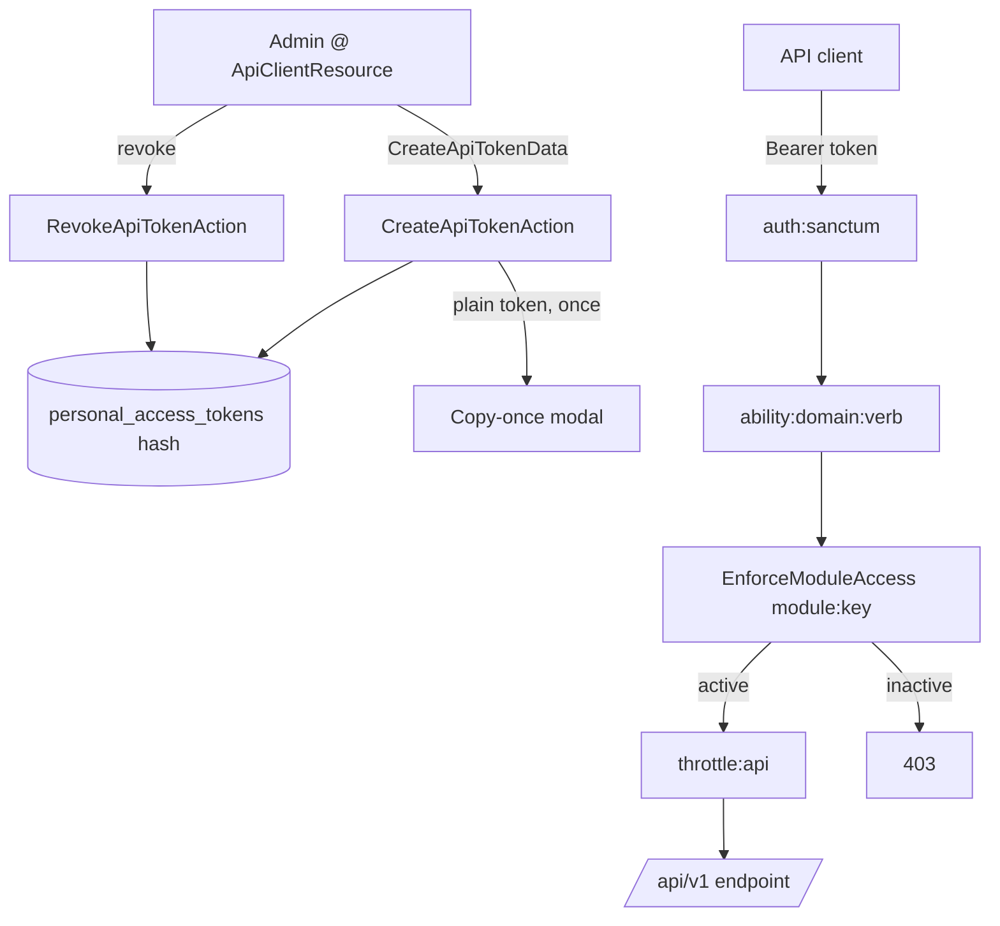

# API Clients — Architecture

Parent: [[_module]] · See also [[api]] · [[data-model]] · [[security]]

## Components

Token management is action-based (no multi-method service): stateless single-step operations over Sanctum's token store.

| Action | Signature | Behavior |
|---|---|---|
| `CreateApiTokenAction` | `run(CreateApiTokenData $data): string` | creates a Sanctum token with the requested abilities; **returns the plain token once** |
| `RevokeApiTokenAction` | `run(string $tokenId): void` | deletes a single token row |
| `RevokeAllApiTokensAction` | `run(): void` | revokes all tokens for the company's service user |

## Request-time middleware

API routes in `routes/api.php` (v1 group) stack:

| Layer | Purpose |
|---|---|
| `auth:sanctum` | resolves the bearer token to its user + abilities |
| `ability:{domain}:{verb}` | Sanctum ability check — e.g. `ability:hr:read` |
| `module:{module-key}` via `EnforceModuleAccess` | rejects calls to a module the company hasn't activated (`BillingService::hasModule`) → 403 |
| `throttle:api` / `throttle:api-write` | per-token rate limits → 429 + Retry-After |

`EnforceModuleAccess` is the API analogue of the `canAccess()` module gate used by Filament resources.

## Flow

