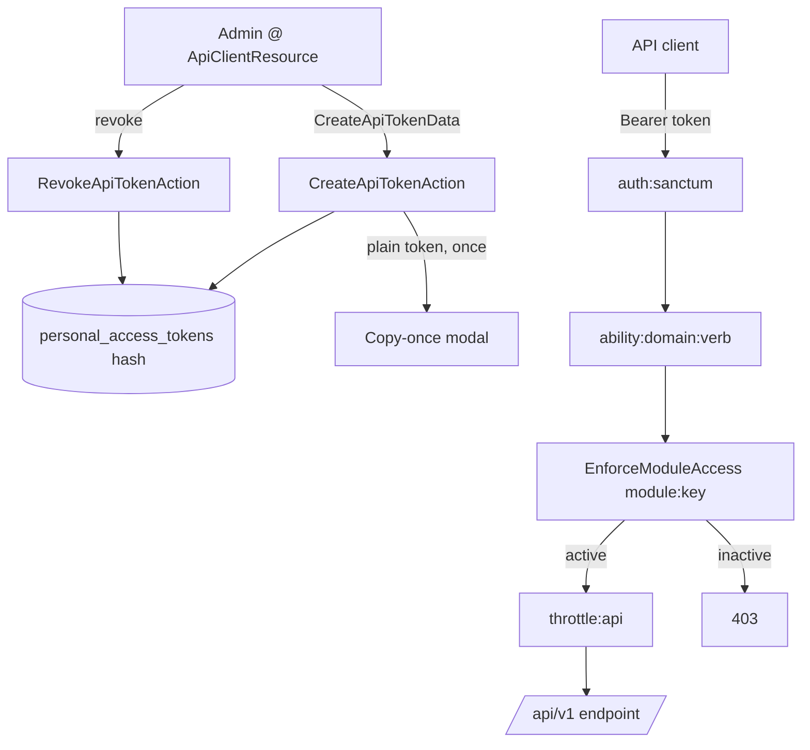

# API Clients — Architecture

Parent: [[_module]] · See also [[api]] · [[data-model]] · [[security]]

## Components

Token management is action-based (no multi-method service): stateless single-step operations over Sanctum's token store.

| Action | Signature | Behavior |
|---|---|---|
| `CreateApiTokenAction` | `run(CreateApiTokenData $data): string` | creates a Sanctum token with the requested abilities, bound to the issuing user's `company_id`, 90-day default expiry; **returns the plain token once** |
| `RotateApiTokenAction` | `run(string $tokenId): string` | issues a replacement with identical abilities + company binding, revokes the original after a 7-day grace overlap; **returns the new plain token once** (see Token hardening below) |
| `RevokeApiTokenAction` | `run(string $tokenId): void` | deletes a single token row |
| `RevokeAllApiTokensAction` | `run(): void` | revokes all tokens for the company's service user |

## Request-time middleware

API routes in `routes/api.php` (v1 group) stack:

| Layer | Purpose |
|---|---|
| `auth:sanctum` | resolves the bearer token to its user + abilities |
| `ability:{domain}:{verb}` | Sanctum ability check — e.g. `ability:hr:read` |
| `module:{module-key}` via `EnforceModuleAccess` | rejects calls to a module the company hasn't activated (`BillingService::hasModule`) → 403 |
| `throttle:api` / `throttle:api-write` | per-token rate limits → 429 + Retry-After |

`EnforceModuleAccess` is the API analogue of the `canAccess()` module gate used by Filament resources.

## Flow

## Token hardening (ADR-aligned)

Per [[../../../decisions/decision-2026-07-02-rate-limit-and-token-hardening]]:

- **90-day default expiry** on new tokens *(assumed — tunable)*; expiry-warning notification 14 days out via `core.notifications`.
- **Rotation**: `RotateApiTokenAction` (endpoint `POST /api/v1/auth/tokens/{id}/rotate`, see [[api]]) issues a replacement with the same abilities + company binding and revokes the original with a 7-day grace overlap for zero-downtime rotation.
- **Explicit company binding**: a token is bound to the issuing user's `company_id` at creation; request-time middleware sets the permission team context from the *token's* company, not the current user's, and tokens are revoked on company detach/offboarding.
- **Per-company quota**: the `api-company` limiter (1000 req/min per `company_id` *(assumed)*) layers on top of the per-token `api` / `api-write` limits — see [[security]].

## Filament Artifacts

**Nav group:** Settings *(assumed)*

| Artifact | Kind ([[../../../architecture/ui-strategy]] row) | Blueprint / Tweaks | Notes |
|---|---|---|---|
| `ApiClientResource` | #1 CRUD resource | tweaks: custom-header-actions (create-token copy-once modal, rotate, revoke, revoke-all) | list columns: name, scopes, `last_used_at`, `expires_at`, created-by; token secret shown once at create/rotate only |

**Access contract (mandatory):** the resource and all its actions gate on
`canAccess() = Auth::user()->can('core.api.view-any') && BillingService::hasModule('core.api')`
per [[../../../architecture/filament-patterns]] #1. Non-CRUD header actions (create / rotate / revoke) each carry their own permission (see [[security]]) and the `panel-action` rate limiter. The REST edge itself is not a Filament artifact — it is guarded by `auth:sanctum` + `ability:{domain}:{verb}` + `EnforceModuleAccess` per the middleware stack above (Vue/portal surfaces N/A for this backend module).

## Concurrency

| Write path | Tier | Mechanism |
|---|---|---|
| Token create / revoke / revoke-all | n/a | Insert-once / delete-only — tokens are immutable after creation (abilities never edited); no concurrent-edit surface |
| Token rotate | Pessimistic | `DB::transaction()` + `lockForUpdate()` on the original row: re-read, issue replacement, revoke original atomically — prevents double-rotate ([[../../../architecture/patterns/states]]) |

Tiers per [[../../../decisions/decision-2026-07-02-optimistic-locking-standard]].
