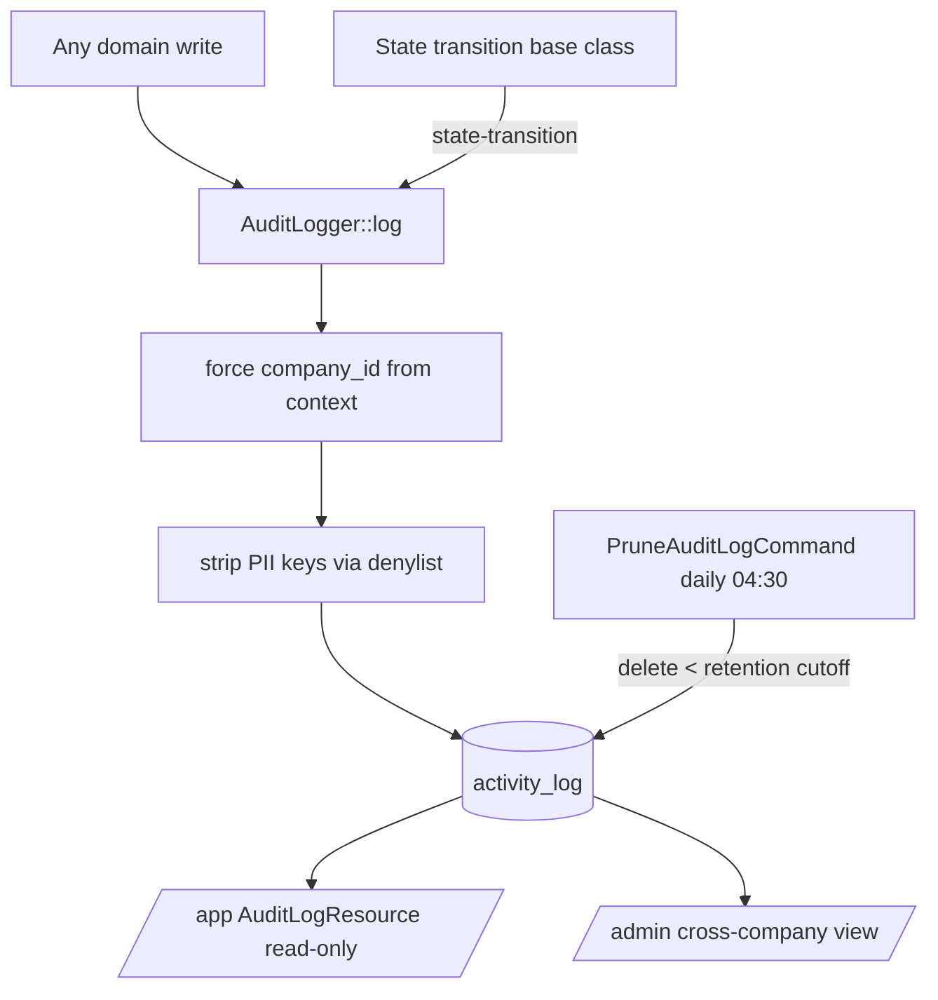

# Audit Log — Architecture

Parent: [[_module]] · See also [[data-model]] · [[security]]

## Components

**Service (single entry point):** `AuditLogger`

| Method | Behavior |
|---|---|
| `AuditLogger::log(string $event, Model $subject, ?User $causer, array $properties = []): void` | wraps spatie `activity()`, **force-sets `company_id` from context**, strips PII keys against a denylist *(assumed: per-model `$auditExclude` list)* before persisting |

No domain writes directly to `activity_log` — every write routes through this service. `$causer` is null for system/job-driven writes.

## State-transition auto-logging

State machines (spatie/laravel-model-states) auto-log transitions via the transition base class ([[../../../architecture/patterns/states]]): each transition writes a `state-transition` log row carrying from/to. No per-domain wiring required.

## Jobs & Scheduling

| Command | Queue | Schedule | Idempotency |
|---|---|---|---|
| `PruneAuditLogCommand` | default | daily 04:30 | deletes WHERE `created_at < retention cutoff` — naturally idempotent |

Retention cutoff is per-company (default 2 years, from company privacy settings) — see [[../../../architecture/data-lifecycle]].

## Rendering

Logs are rendered read-only by the `rmsramos/activitylog` Filament resource (`/app`), and via a scope-bypassing cross-company view in `/admin` (see [[security]]). There are no DTOs and no events — writes go through the service, reads through the package resource.

## Flow

