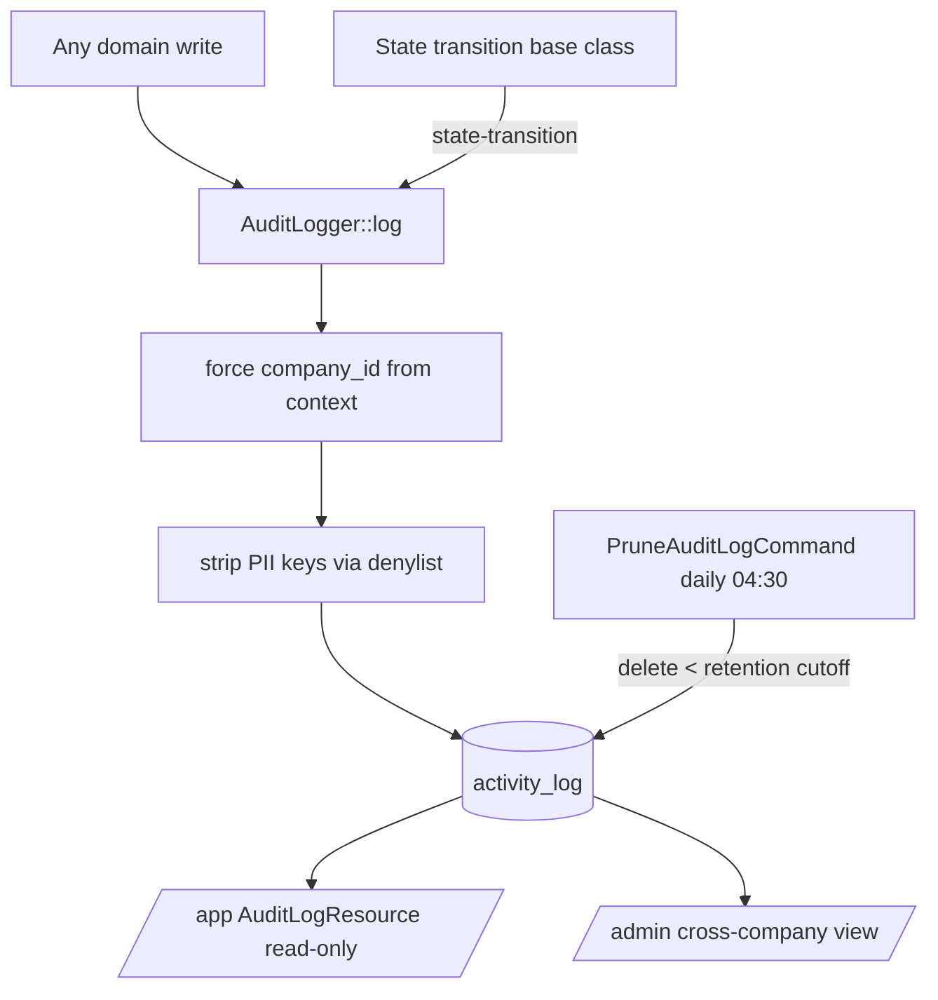

# Audit Log — Architecture

Parent: [[_module]] · See also [[data-model]] · [[security]]

## Components

**Service (single entry point):** `AuditLogger`

| Method | Behavior |
|---|---|
| `AuditLogger::log(string $event, Model $subject, ?User $causer, array $properties = []): void` | wraps spatie `activity()`, **force-sets `company_id` from context**, strips PII keys against a denylist *(assumed: per-model `$auditExclude` list)* before persisting |

No domain writes directly to `activity_log` — every write routes through this service. `$causer` is null for system/job-driven writes.

## State-transition auto-logging

State machines (spatie/laravel-model-states) auto-log transitions via the transition base class ([[../../../architecture/patterns/states]]): each transition writes a `state-transition` log row carrying from/to. No per-domain wiring required.

## Jobs & Scheduling

| Command | Queue | Schedule | Idempotency |
|---|---|---|---|
| `PruneAuditLogCommand` | default | daily 04:30 | deletes WHERE `created_at < retention cutoff` — naturally idempotent |

Retention cutoff is per-company (default 2 years, from company privacy settings) — see [[../../../architecture/data-lifecycle]].

## Rendering

Logs are rendered read-only by the `rmsramos/activitylog` Filament resource (`/app`), and via a scope-bypassing cross-company view in `/admin` (see [[security]]). There are no DTOs and no events — writes go through the service, reads through the package resource.

## Flow

## Filament Artifacts

**Nav group:** Settings *(assumed)*

| Artifact | Kind ([[../../../architecture/ui-strategy]] row) | Blueprint / Tweaks | Notes |
|---|---|---|---|
| `AuditLogResource` (/app) | #1 CRUD resource | tweaks: read-only-flow-owned (`AuditLogger` owns all writes → `canCreate(): false`, no edit/delete) | `rmsramos/activitylog`-provided, configured; filters: domain (`log_name`), action type, causer, date range, subject; company-scoped |
| Cross-company log view (/admin) | #1 CRUD resource | tweaks: read-only-flow-owned | admin-guard only; bypasses tenant scope (`withoutGlobalScope`) — FlowFlex staff review across all companies |

**Access contract (mandatory):** the `/app` resource gates on
`canAccess() = Auth::user()->can('core.audit.view-any') && BillingService::hasModule('core.audit')`
per [[../../../architecture/filament-patterns]] #1. The resource is read-only (no create/edit/delete). The `/admin` cross-company variant gates on the admin guard only (FlowFlex staff) and is never exposed in a company panel — see [[security]]. This is a backend-observability module; no Vue/portal surfaces.

## Concurrency

| Write path | Tier | Mechanism |
|---|---|---|
| `AuditLogger::log` insert | n/a | Append-only — each call inserts one immutable log row; no update path, no concurrent-edit surface |
| `PruneAuditLogCommand` delete | n/a | Delete-only `WHERE created_at < cutoff`, naturally idempotent; no contended row |
| Log browser (read) | n/a | Read-only surface — no writes |

Tiers per [[../../../decisions/decision-2026-07-02-optimistic-locking-standard]].
