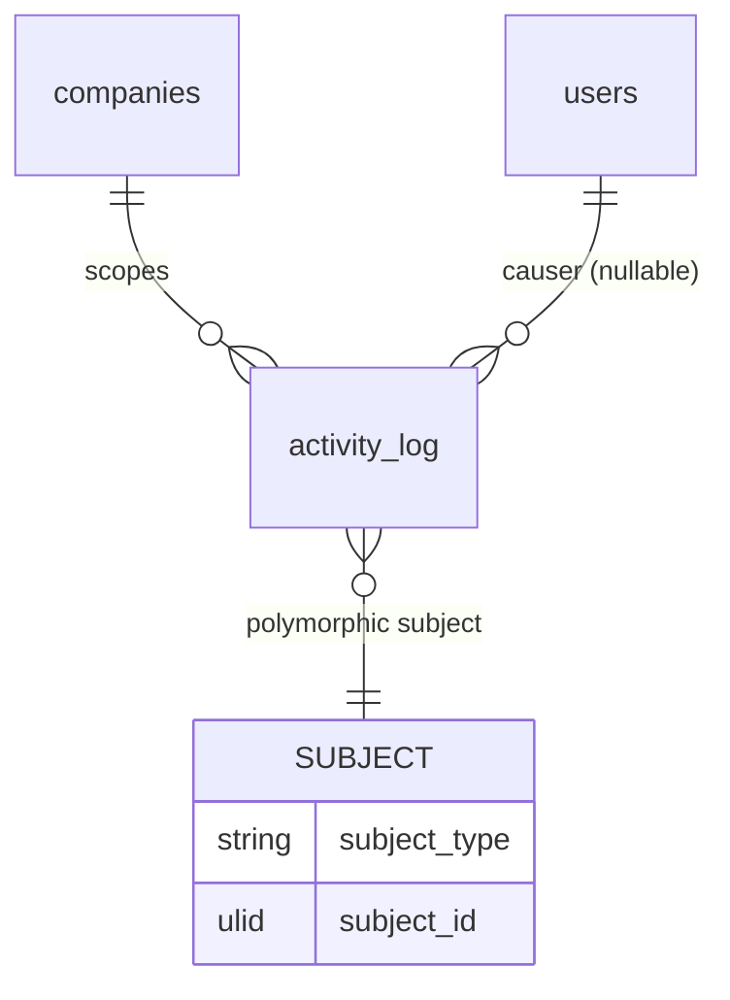

# Audit Log — Data Model

Parent: [[_module]] · See also [[architecture]] · [[security]]

Owns one table: `activity_log` (Spatie's published migration, extended with `company_id`).

## activity_log

| Column | Type | Notes |
|---|---|---|
| id | ulid | PK |
| log_name | string | domain name (e.g. `hr`, `finance`, `state-transition`) |
| description | string | human-readable action |
| subject_type / subject_id | string / ulid | target model |
| causer_type / causer_id | string / ulid | acting user (null for system/jobs) |
| properties | jsonb | before/after (PII rule applies), ip *(assumed: ip captured in properties)* |
| company_id | ulid | tenant scope — **added column, indexed** |
| created_at | timestamp | |

**Indexes:** `(company_id, created_at)`, `(company_id, subject_type, subject_id)`

