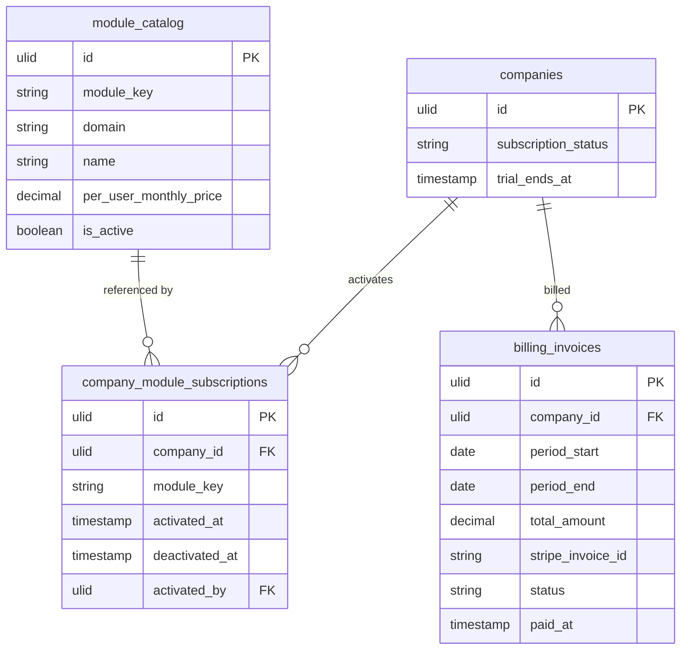

# Billing Engine

Manages company subscriptions to FlowFlex modules: activation/deactivation, monthly invoice calculation, Stripe payment processing, dunning for failed payments, and MRR/churn metrics. The central gating service for all optional domain modules.

---

## Core Features

- `BillingService::hasModule(string $key)` — the single method all `canAccess()` checks call
- Module activation: one-click from marketplace, recorded in `company_module_subscriptions`
- Module deactivation: gates access, retains data, reactivation restores same state
- Monthly invoice calculation: `sum(module_price_per_user) × active_user_count`
- Stripe integration: customer creation, subscription items, invoice generation, webhook handling
- Dunning: payment retry schedule, suspension after N failed attempts
- Subscription status: `trial → active → suspended → cancelled` on `companies.subscription_status`
- MRR tracking, churn metrics, module adoption rates (surfaced in `/admin` for FlowFlex staff)
- Recurring invoice PDF generation and email delivery

---

## Data Model

| Table | Key Columns |
|---|---|
| `module_catalog` | module_key (unique), domain, name, per_user_monthly_price, is_active — backed by Sushi (static data) |
| `company_module_subscriptions` | company_id, module_key, activated_at, deactivated_at, activated_by |
| `billing_invoices` | company_id, period_start, period_end, total_amount, stripe_invoice_id, status, paid_at |
| `billing_invoice_lines` | invoice_id, module_key, module_name, user_count, unit_price, line_total |

---

## Filament

**`/app` panel:**
- `BillingResource` — view current subscription, active modules, invoices
- `ModuleMarketplacePage` (custom page) — activate/deactivate modules, see pricing
- `BillingWidget` — current MRR, next invoice date, payment status banner

**`/admin` panel (FlowFlex staff):**
- `BillingOverviewResource` — all companies: MRR, churn, trial conversions
- `ModulePricingResource` — set per-module prices globally

---

## Related

- [[domains/core/module-marketplace]]
- [[product/pricing-model]]
- [[architecture/packages]] (`calebporzio/sushi` for module catalog)
