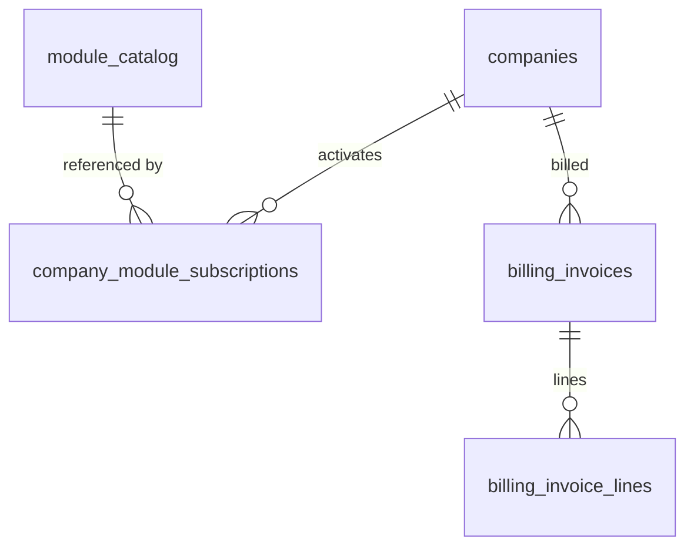

# Billing Engine

Manages company subscriptions to FlowFlex modules: activation/deactivation, monthly invoice calculation, Stripe payment processing, dunning for failed payments, and MRR/churn metrics. The central gating service for all optional domain modules — `BillingService::hasModule()` is called by every `canAccess()` in the product.

---

## Dependencies

| Type | Module | Why |
|---|---|---|
| Hard | [[domains/foundation/filament-panels\|foundation.panels]] | `/app` + `/admin` surfaces |
| Hard | [[domains/foundation/multi-tenancy-layer\|foundation.tenancy]] | subscriptions company-scoped |
| Hard | [[domains/foundation/queue-workers\|foundation.queues]] | invoice generation + dunning jobs |
| Hard | [[domains/core/company-settings\|core.settings]] | currency, company identity on invoices |
| Soft | [[domains/core/notifications\|core.notifications]] | consumes ModuleActivated/Suspended; without it events fire unconsumed |

---

## Core Features

- `BillingService::hasModule(string $key)` — the single method all `canAccess()` checks call (cached 5 min — [[architecture/caching]])
- Module activation: one-click from marketplace, recorded in `company_module_subscriptions`
- Module deactivation: gates access, retains data; reactivation creates a new row (history preserved)
- Monthly invoice calculation: `sum(module_price_per_user) × active_user_count`
- Stripe integration: raw `stripe/stripe-php` SDK — customer creation, subscription items per module, invoice generation, webhook handling (per [[build/decisions/decision-2026-06-01-stripe-cashier-vs-sdk]]; signature verification per [[architecture/security]])
- Dunning: payment retry schedule (3 attempts over 14 days *(assumed)*), suspension after final failure
- Subscription status: `trial → active → suspended → cancelled` on `companies.subscription_status`
- MRR tracking, churn metrics, module adoption rates (surfaced in `/admin` for FlowFlex staff)
- Recurring invoice PDF generation and email delivery

---

## Data Model

### module_catalog — backed by `calebporzio/sushi` static array (no migration)

| Column | Type | Notes |
|---|---|---|
| module_key | string unique | e.g. `hr.payroll` |
| domain | string | |
| name | string | marketplace display |
| per_user_monthly_price_cents | int | minor units *(was decimal in v1 spec — integer per money convention)* |
| is_active | boolean | hides from marketplace, keeps existing subscribers |

### company_module_subscriptions

| Column | Type | Constraints | Notes |
|---|---|---|---|
| id | ulid | PK | |
| company_id | ulid | not null, indexed | |
| module_key | string | not null | matches catalog |
| activated_at | timestamp | not null | |
| deactivated_at | timestamp | nullable | null = active |
| activated_by | ulid | nullable FK users | null for seeded free modules |

**Indexes:** `(company_id, module_key, deactivated_at)`

### billing_invoices

| Column | Type | Constraints | Notes |
|---|---|---|---|
| id | ulid | PK | |
| company_id | ulid | not null, indexed | |
| period_start / period_end | date | not null | |
| total_cents | bigint | not null | brick/money |
| currency | string(3) | not null | |
| stripe_invoice_id | string | nullable, unique | |
| status | string | not null, default `draft` | state machine |
| paid_at | timestamp | nullable | |
| deleted_at | timestamp | nullable | |

### billing_invoice_lines

| Column | Type | Notes |
|---|---|---|
| id, invoice_id FK, company_id | ulid | |
| module_key, module_name | string | snapshot at billing time |
| user_count | int | |
| unit_price_cents, line_total_cents | bigint | |



---

## State Machine

Column: `billing_invoices.status` — `BillingInvoiceState`.

| State | Transitions to | Triggered by | Side effects |
|---|---|---|---|
| `draft` | `open` | monthly billing job | Stripe invoice created |
| `open` | `paid` | Stripe webhook `invoice.payment_succeeded` | `paid_at` set |
| `open` | `past_due` | Stripe webhook payment failed | dunning schedule starts |
| `past_due` | `paid` | retry succeeds | dunning cancelled |
| `past_due` | `uncollectible` | dunning exhausted | fires `CompanySubscriptionSuspended`; company status → suspended |

Company `subscription_status` transitions handled in `BillingService` (not a spatie state machine — simple enum on companies *(assumed)*).

---

## DTOs

### ActivateModuleData (input)
| Field | Type | Validation |
|---|---|---|
| module_key | string | required, exists in catalog, `is_active`, not already active |

### BillingInvoiceData (output)
id, period_start, period_end, total_cents, currency, total_formatted, status, paid_at, lines[] (module_name, user_count, unit_price_cents, line_total_cents)

## Services & Actions

Interface→Service: `BillingServiceInterface` → `BillingService`.

- `hasModule(string $moduleKey): bool` — cached; never call raw in a loop
- `activateModule(ActivateModuleData $data): void` — creates subscription row, busts module cache, syncs Stripe subscription item, fires `ModuleActivated`; throws `ModuleAlreadyActiveException`
- `deactivateModule(string $moduleKey): void` — sets `deactivated_at`, busts cache, removes Stripe item; throws `CannotDeactivateCoreModuleException`
- `generateMonthlyInvoice(string $companyId, CarbonImmutable $period): BillingInvoiceData` — idempotent per `(company, period)` unique constraint
- `handleStripeWebhook(array $event): void` — signature-verified upstream; routes per event type
- `suspend(string $companyId, string $reason): void` — fires `CompanySubscriptionSuspended`
- `mrr(): Money` / `churnRate(CarbonImmutable $period): float` — admin metrics

---

## Events

### Fires: ModuleActivated
| Payload field | Type |
|---|---|
| company_id | string |
| module_key | string |
| activated_by | string |
| activated_at | CarbonImmutable |

### Fires: CompanySubscriptionSuspended
| Payload field | Type |
|---|---|
| company_id | string |
| reason | string |
| suspended_at | CarbonImmutable |

Consumers + behavior: [[architecture/event-bus]] contracts. Module cache bust is synchronous in the service, NOT via listener.

---

## Filament

**Nav group:** Billing

| Artifact | Kind ([[architecture/ui-strategy]] row) | Notes |
|---|---|---|
| `BillingResource` (`/app`) | #1 CRUD (read-only) | current subscription, active modules, invoice list + PDF download |
| `BillingWidget` (`/app`) | #6 widget | next invoice estimate, payment status banner |
| `BillingOverviewResource` (`/admin`) | #1 CRUD (read-only) | all companies: MRR, churn, trial conversions |
| `ModulePricingResource` (`/admin`) | #1 CRUD | per-module global prices (writes the catalog source) |

(Marketplace UI itself = [[domains/core/module-marketplace]].)


**Access contract:** every artifact above gates on `canAccess() = Auth::user()->can('core.billing.view-any') && BillingService::hasModule('core.billing')` per [[architecture/filament-patterns]] #1 — custom pages state it explicitly. Public/portal surfaces use a guest or scoped-portal guard (Vue+Inertia per [[architecture/ui-strategy]]).

**Security notes** (per [[build/security-audit-2026-06-11]]):

- **Rate limiter** (medium): Cite a throttle limiter on the Stripe webhook route (e.g. a dedicated 'webhook' limiter) in the routes/Filament section, in addition to the existing signature verification.

---

## Permissions

`core.billing.view` · `core.billing.activate-module` · `core.billing.deactivate-module` · `core.billing.manage-payment-method`

Owner-only by default for activate/deactivate *(assumed)*.

---

## Jobs & Scheduling

| Job / Command | Queue | Schedule | Idempotency |
|---|---|---|---|
| `GenerateMonthlyInvoicesCommand` | finance | monthly, 1st 01:00 | unique `(company_id, period_start)` constraint — re-run skips existing |
| `ProcessDunningCommand` | finance | daily 06:00 | WHERE guards on retry schedule timestamps |
| `SendInvoiceMail` | notifications | on invoice open | — |

## Caching

| Key | TTL | Invalidated by |
|---|---|---|
| `company:{id}:modules` | 5 min | activateModule / deactivateModule |

---

## Test Checklist

- [ ] Tenant isolation: company A subscriptions invisible to company B
- [ ] `hasModule` true after activation, false after deactivation, within one request (cache bust)
- [ ] Free core modules cannot be deactivated
- [ ] Invoice calculation: 15 users × 3 modules matches pricing-model example to the cent (brick/money)
- [ ] `GenerateMonthlyInvoicesCommand` idempotent (run twice = one invoice)
- [ ] Stripe webhook with bad signature → 400, no state change
- [ ] `invoice.payment_succeeded` webhook → status paid + `paid_at`
- [ ] Dunning exhaustion fires `CompanySubscriptionSuspended` + company suspended
- [ ] Suspended company blocked from panels by middleware

---

## Build Manifest

```
database/migrations/xxxx_create_company_module_subscriptions_table.php
database/migrations/xxxx_create_billing_invoices_table.php
database/migrations/xxxx_create_billing_invoice_lines_table.php
app/Models/Core/{ModuleCatalog(sushi),CompanyModuleSubscription,BillingInvoice,BillingInvoiceLine}.php
app/States/Core/BillingInvoice/{BillingInvoiceState,Draft,Open,Paid,PastDue,Uncollectible}.php
app/Data/Core/{ActivateModuleData,BillingInvoiceData}.php
app/Contracts/Core/BillingServiceInterface.php
app/Services/Core/BillingService.php
app/Exceptions/Core/{ModuleAlreadyActiveException,CannotDeactivateCoreModuleException}.php
app/Events/Core/{ModuleActivated,CompanySubscriptionSuspended}.php
app/Http/Controllers/Webhooks/StripeWebhookController.php
app/Http/Middleware/EnsureSubscriptionActive.php
app/Console/Commands/Core/{GenerateMonthlyInvoicesCommand,ProcessDunningCommand}.php
app/Mail/Core/InvoiceMail.php
app/Filament/App/Resources/BillingResource.php
app/Filament/App/Widgets/BillingWidget.php
app/Filament/Admin/Resources/{BillingOverviewResource,ModulePricingResource}.php
database/factories/Core/{CompanyModuleSubscriptionFactory,BillingInvoiceFactory}.php
tests/Feature/Core/{BillingGatingTest,InvoiceGenerationTest,StripeWebhookTest,DunningTest}.php
```

---

## Open Questions

- Stripe subscription-items model vs invoice-per-period: spec assumes FlowFlex computes invoices and creates Stripe invoices directly (not Stripe-managed subscription proration) *(assumed)* — revisit with ADR if proration complexity demands Stripe subscriptions

---

## Related

- [[domains/core/module-marketplace]]
- [[product/pricing-model]]
- [[architecture/module-system]]
- [[build/decisions/decision-2026-06-01-stripe-cashier-vs-sdk]]
- [[architecture/event-bus]]
