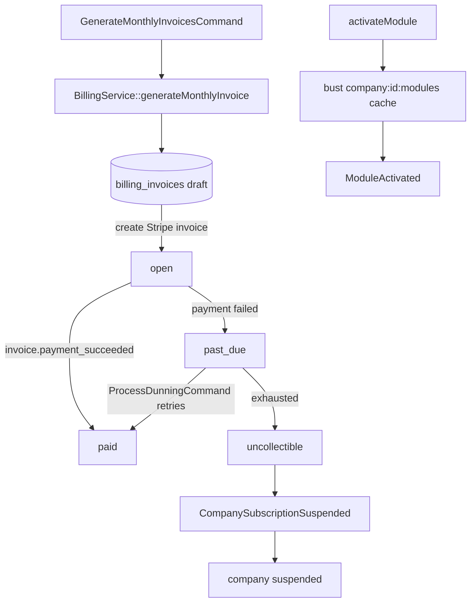

# Billing Engine — Architecture

Parent: [[_module]] · See also [[api]] · [[data-model]]

## Components

**Interface → Service:** `BillingServiceInterface` → `BillingService`

| Method | Behavior |
|---|---|
| `hasModule(string $moduleKey): bool` | cached 5 min; never call raw in a loop |
| `activateModule(ActivateModuleData $data): void` | creates subscription row, busts module cache, syncs Stripe subscription item, fires `ModuleActivated` |
| `deactivateModule(string $moduleKey): void` | sets `deactivated_at`, busts cache, removes Stripe item |
| `generateMonthlyInvoice(string $companyId, CarbonImmutable $period): BillingInvoiceData` | idempotent per `(company, period)` unique constraint |
| `handleStripeWebhook(array $event): void` | signature-verified upstream; routes per event type |
| `suspend(string $companyId, string $reason): void` | fires `CompanySubscriptionSuspended` |
| `mrr(): Money` / `churnRate(CarbonImmutable $period): float` | admin metrics |

Module cache bust is **synchronous** in the service, not via listener.

## States — `BillingInvoiceState` (spatie/laravel-model-states)

Column: `billing_invoices.status`. Classes: `Draft`, `Open`, `Paid`, `PastDue`, `Uncollectible`.

| State | → | Trigger | Side effects |
|---|---|---|---|
| `draft` | `open` | monthly billing job | Stripe invoice created |
| `open` | `paid` | webhook `invoice.payment_succeeded` | `paid_at` set |
| `open` | `past_due` | webhook payment failed | dunning schedule starts |
| `past_due` | `paid` | retry succeeds | dunning cancelled |
| `past_due` | `uncollectible` | dunning exhausted | fires `CompanySubscriptionSuspended`; company → suspended |

Company `subscription_status` transitions handled in `BillingService` (simple enum on companies, *not* a spatie state machine) *(assumed)*.

## Listeners & Notifications

- `NotifyModuleActivatedListener` → `ModuleActivatedNotification`
- `NotifySubscriptionSuspendedListener` → `SubscriptionSuspendedNotification`

## Jobs & Scheduling

| Command | Queue | Schedule | Idempotency |
|---|---|---|---|
| `GenerateMonthlyInvoicesCommand` | finance | monthly, 1st 01:00 | unique `(company_id, period_start)` — re-run skips existing |
| `ProcessDunningCommand` | finance | daily 06:00 | WHERE guards on retry schedule timestamps |
| `InvoiceMail` (mailable) | notifications | on invoice open | — |

## Caching

| Key | TTL | Invalidated by |
|---|---|---|
| `company:{id}:modules` | 5 min | activateModule / deactivateModule |

## Filament Artifacts

**Nav group:** Billing *(assumed)*

| Artifact | Kind ([[../../../architecture/ui-strategy]] row) | Blueprint / Tweaks | Notes |
|---|---|---|---|
| `BillingResource` (/app) | #1 CRUD resource | tweaks: read-only-flow-owned (`BillingService` + Stripe own all invoice writes → `canCreate(): false`), state-badge-column (invoice status), pdf-preview-panel (invoice PDF), custom-header-actions (manage payment method) | `ListBillingInvoices` page; list filters: status, period; payment-method surface via Stripe Elements ([[./features/monthly-invoicing]], [[./features/stripe-integration]]) |
| Billing metrics widgets (/admin) | #6 dashboard widgets ([[../../../architecture/patterns/page-blueprints#Dashboard]]) | MRR / churn / active-companies `blueprint-cell` stat tiles + per-module adoption chart (apexcharts) | staff panel only; widget polling 30–60s; read-only ([[./features/admin-metrics]]) |

**Access contract (mandatory):** every `/app` artifact gates on
`canAccess() = Auth::user()->can('core.billing.view-any') && BillingService::hasModule('core.billing')`
per [[../../../architecture/filament-patterns]] #1. The `manage payment method` header action additionally requires `core.billing.manage-payment-method` and carries the `panel-action` rate limiter (it calls the external Stripe API). The `/admin` metrics widgets gate on the admin-panel guard + `core.billing.view` (FlowFlex staff) and are never exposed in a company panel. The activate/deactivate controls live in [[../module-marketplace/_module]] (self-service) and [[../staff-console/_module]] (staff), gated on `core.billing.activate-module` / `.deactivate-module`. The Stripe webhook edge is not a Filament artifact — it is signature-verified + `webhook` rate-limited per [[security]].

## Concurrency

| Write path | Tier | Mechanism |
|---|---|---|
| Module activate / deactivate (subscription row + Stripe item sync) | Pessimistic | `DB::transaction()` + `lockForUpdate()` on the company's subscription rows: re-read, guard against double-activate, sync the Stripe item, bust `company:{id}:modules` cache atomically ([[../../../architecture/patterns/states]]) |
| Monthly invoice generation | n/a | Insert-once — unique `(company_id, period_start)` constraint makes re-runs skip existing; no concurrent-edit surface |
| Invoice state transition (open / paid / past_due / uncollectible — Stripe webhook + dunning) | Pessimistic | Money mutation + state machine: `DB::transaction()` + `lockForUpdate()` on the invoice row, re-read, validate, write per [[../../../architecture/patterns/states]] — safe against duplicate/concurrent webhook delivery |
| `hasModule` / MRR / churn reads | n/a | Read-only (cached) — no write path |

Tiers per [[../../../decisions/decision-2026-07-02-optimistic-locking-standard]].

## Flow

