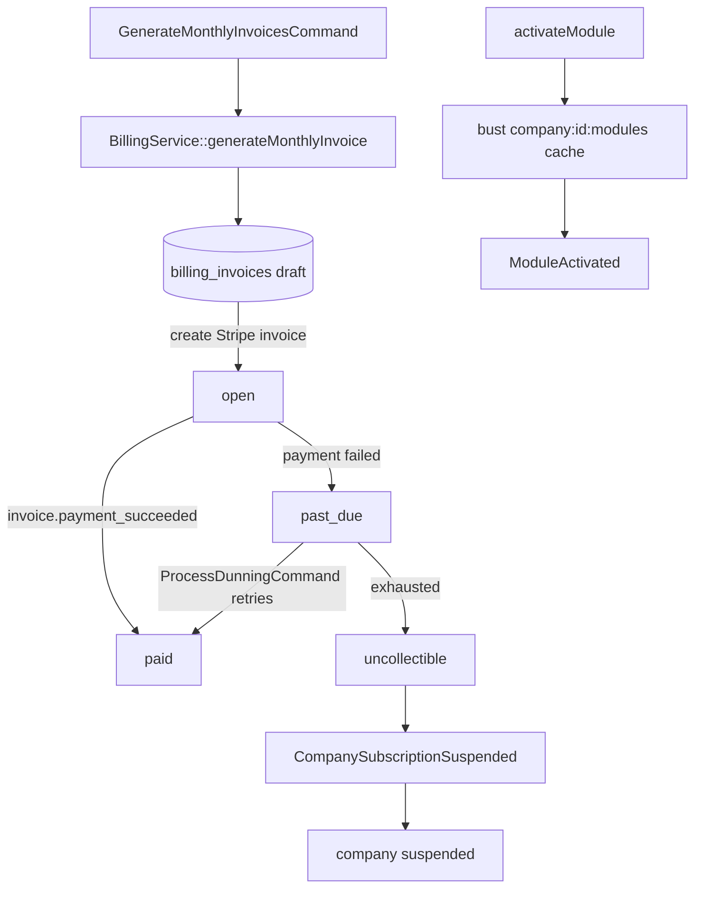

# Billing Engine — Architecture

Parent: [[_module]] · See also [[api]] · [[data-model]]

## Components

**Interface → Service:** `BillingServiceInterface` → `BillingService`

| Method | Behavior |
|---|---|
| `hasModule(string $moduleKey): bool` | cached 5 min; never call raw in a loop |
| `activateModule(ActivateModuleData $data): void` | creates subscription row, busts module cache, syncs Stripe subscription item, fires `ModuleActivated` |
| `deactivateModule(string $moduleKey): void` | sets `deactivated_at`, busts cache, removes Stripe item |
| `generateMonthlyInvoice(string $companyId, CarbonImmutable $period): BillingInvoiceData` | idempotent per `(company, period)` unique constraint |
| `handleStripeWebhook(array $event): void` | signature-verified upstream; routes per event type |
| `suspend(string $companyId, string $reason): void` | fires `CompanySubscriptionSuspended` |
| `mrr(): Money` / `churnRate(CarbonImmutable $period): float` | admin metrics |

Module cache bust is **synchronous** in the service, not via listener.

## States — `BillingInvoiceState` (spatie/laravel-model-states)

Column: `billing_invoices.status`. Classes: `Draft`, `Open`, `Paid`, `PastDue`, `Uncollectible`.

| State | → | Trigger | Side effects |
|---|---|---|---|
| `draft` | `open` | monthly billing job | Stripe invoice created |
| `open` | `paid` | webhook `invoice.payment_succeeded` | `paid_at` set |
| `open` | `past_due` | webhook payment failed | dunning schedule starts |
| `past_due` | `paid` | retry succeeds | dunning cancelled |
| `past_due` | `uncollectible` | dunning exhausted | fires `CompanySubscriptionSuspended`; company → suspended |

Company `subscription_status` transitions handled in `BillingService` (simple enum on companies, *not* a spatie state machine) *(assumed)*.

## Listeners & Notifications

- `NotifyModuleActivatedListener` → `ModuleActivatedNotification`
- `NotifySubscriptionSuspendedListener` → `SubscriptionSuspendedNotification`

## Jobs & Scheduling

| Command | Queue | Schedule | Idempotency |
|---|---|---|---|
| `GenerateMonthlyInvoicesCommand` | finance | monthly, 1st 01:00 | unique `(company_id, period_start)` — re-run skips existing |
| `ProcessDunningCommand` | finance | daily 06:00 | WHERE guards on retry schedule timestamps |
| `InvoiceMail` (mailable) | notifications | on invoice open | — |

## Caching

| Key | TTL | Invalidated by |
|---|---|---|
| `company:{id}:modules` | 5 min | activateModule / deactivateModule |

## Flow

