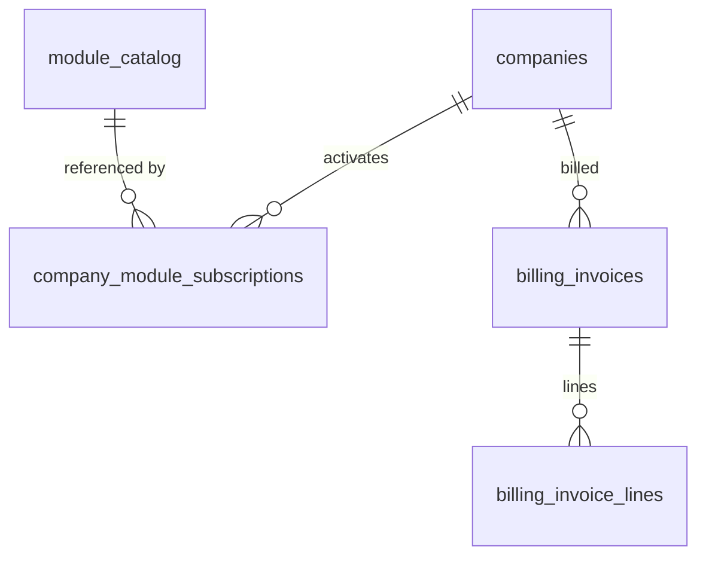

# Billing Engine — Data Model

Parent: [[_module]] · See also [[architecture]] · [[security]]

Tables: `company_module_subscriptions`, `billing_invoices`, `billing_invoice_lines` (migrations confirmed), `module_catalog` (Sushi, no migration), plus `companies.stripe_customer_id` (text/encrypted).

## module_catalog — real table (2026-07-04 build correction: was specced as Sushi; a DB table lets staff manage the catalog + prices without deploys; seeded by ModuleCatalogSeeder)

| Column | Type | Notes |
|---|---|---|
| module_key | string unique | e.g. `hr.payroll` |
| domain | string | |
| name | string | marketplace display |
| per_user_monthly_price_cents | int | minor units |
| is_active | boolean | hides from marketplace, keeps existing subscribers |

## company_module_subscriptions

| Column | Type | Constraints | Notes |
|---|---|---|---|
| id | ulid | PK | |
| company_id | ulid | not null, indexed | |
| module_key | string | not null | matches catalog |
| activated_at | timestamp | not null | |
| deactivated_at | timestamp | nullable | null = active |
| activated_by | ulid | nullable FK users | null for seeded free modules |

**Index:** `(company_id, module_key, deactivated_at)`

## billing_invoices

| Column | Type | Constraints | Notes |
|---|---|---|---|
| id | ulid | PK | |
| company_id | ulid | not null, indexed | |
| period_start / period_end | date | not null | |
| total_cents | bigint | not null | brick/money |
| currency | string(3) | not null | |
| stripe_invoice_id | string | nullable, unique | |
| status | string | not null, default `draft` | state machine |
| paid_at | timestamp | nullable | |
| deleted_at | timestamp | nullable | |

## billing_invoice_lines

| Column | Type | Notes |
|---|---|---|
| id, invoice_id FK, company_id | ulid | |
| module_key, module_name | string | snapshot at billing time |
| user_count | int | |
| unit_price_cents, line_total_cents | bigint | |

