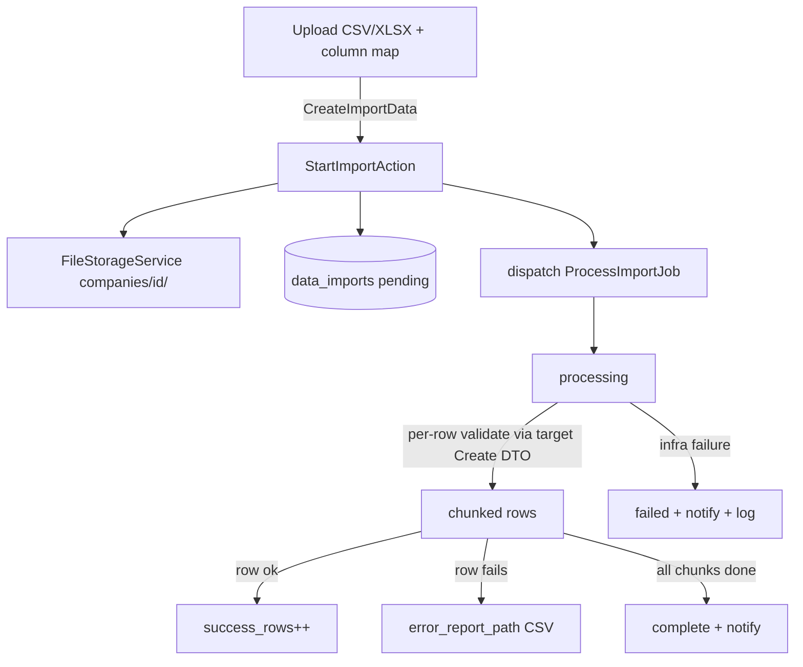

# Data Import — Architecture

Parent: [[_module]] · See also [[api]] · [[data-model]] · [[security]]

## Components

| Component | Role |
|---|---|
| `ImporterRegistry` | registry: `register(string $key, class-string $importer)` / `available(): array` (filters by `hasModule`) |
| `ImporterInterface` | contract each domain's importer implements (see [[api]]) |
| `StartImportAction` | `run(CreateImportData $data): DataImport` — stores the file via `FileStorageService`, creates the `data_imports` row, dispatches `ProcessImportJob` |
| `ProcessImportJob` | `imports` queue, `WithCompanyContext`, chunked rows, per-row validate via the target module's Create DTO, per-row try/catch |

Each domain module registers its own importer + template with the registry; the import UI lists only targets whose module is active.

## State Machine — `DataImportState` (spatie/laravel-model-states)

Column: `data_imports.status`. Classes: `Pending`, `Processing`, `Complete`, `Failed`.

| State | → | Trigger | Side effects |
|---|---|---|---|
| `pending` | `processing` | job picked up | — |
| `processing` | `complete` | all chunks done | notification to importer |
| `processing` | `failed` | infrastructure failure (**not** row errors) | notification + error log |

Row-level errors do **not** fail the import — they land in the downloadable error report ([[features/error-report]]).

## Jobs & Scheduling

| Job | Queue | Schedule | Idempotency |
|---|---|---|---|
| `ProcessImportJob` | imports | on demand | rows upserted on the target's natural key where the importer defines one; otherwise duplicate-guard per importer *(assumed)* |

Chunking + idempotency rules per [[../../../architecture/queue-jobs]].

## Flow

