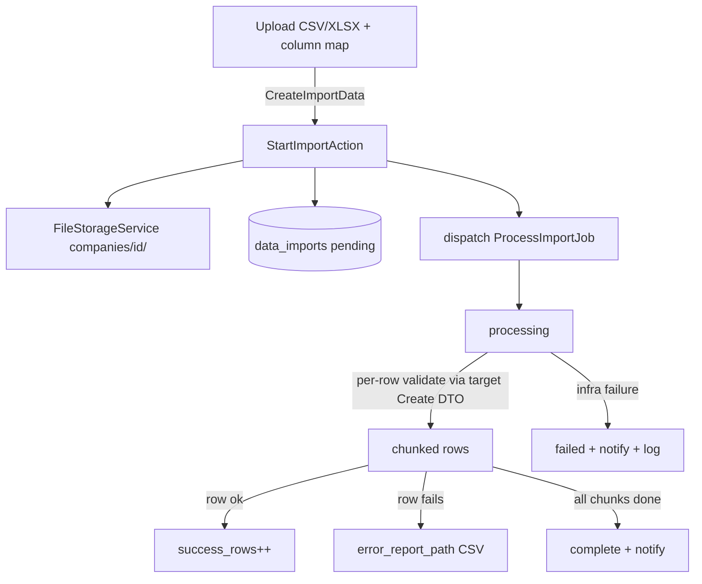

# Data Import — Architecture

Parent: [[_module]] · See also [[api]] · [[data-model]] · [[security]]

## Components

| Component | Role |
|---|---|
| `ImporterRegistry` | registry: `register(string $key, class-string $importer)` / `available(): array` (filters by `hasModule`) |
| `ImporterInterface` | contract each domain's importer implements (see [[api]]) |
| `StartImportAction` | `run(CreateImportData $data): DataImport` — stores the file via `FileStorageService`, creates the `data_imports` row, dispatches `ProcessImportJob` |
| `ProcessImportJob` | `imports` queue, `WithCompanyContext`, chunked rows, per-row validate via the target module's Create DTO, per-row try/catch |

Each domain module registers its own importer + template with the registry; the import UI lists only targets whose module is active.

## State Machine — `DataImportState` (spatie/laravel-model-states)

Column: `data_imports.status`. Classes: `Pending`, `Processing`, `Complete`, `Failed`.

| State | → | Trigger | Side effects |
|---|---|---|---|
| `pending` | `processing` | job picked up | — |
| `processing` | `complete` | all chunks done | notification to importer |
| `processing` | `failed` | infrastructure failure (**not** row errors) | notification + error log |

Row-level errors do **not** fail the import — they land in the downloadable error report ([[features/error-report]]).

## Jobs & Scheduling

| Job | Queue | Schedule | Idempotency |
|---|---|---|---|
| `ProcessImportJob` | imports | on demand | rows upserted on the target's natural key where the importer defines one; otherwise duplicate-guard per importer *(assumed)* |

Chunking + idempotency rules per [[../../../architecture/queue-jobs]].

## Filament Artifacts

**Nav group:** Settings *(assumed)*

| Artifact | Kind ([[../../../architecture/ui-strategy]] row) | Blueprint / Tweaks | Notes |
|---|---|---|---|
| `DataImportResource` (/app) | #1 CRUD resource | tweaks: state-badge-column (import status), custom-header-actions (download error report) | list = import history (target, filename, counts, status, date); view page shows live counts + error-report download ([[./features/error-report]]) |
| `DataImportResource` Create page (import wizard) | #7 Multi-step wizard custom page | [[../../../architecture/patterns/page-blueprints#Wizard]] | upload → column-map → validation-preview steps; all required fields must map before **Start import** ([[./features/column-mapping]]) |

**Access contract (mandatory):** the resource gates on
`canAccess() = Auth::user()->can('core.import.view-any') && BillingService::hasModule('core.import')`
per [[../../../architecture/filament-patterns]] #1. The wizard Create page is a custom page and MUST state its gate explicitly — it additionally requires `core.import.create`, and the **Start import** action carries the `import` rate limiter (bounds bulk-upload abuse — [[security]]). No Vue/portal surface. The target dropdown lists only `ImporterRegistry::available()` targets (module-gated per target).

## Concurrency

| Write path | Tier | Mechanism |
|---|---|---|
| Import create (`data_imports` row + file store + dispatch) | n/a | Insert-once — each import is a new row; no concurrent-edit surface |
| Import status transition (`pending → processing → complete`/`failed`) | Pessimistic | State machine: `DB::transaction()` + `lockForUpdate()`, re-read, validate, write per [[../../../architecture/patterns/states]] |
| Row counters + `error_report_path` writes | n/a | Single-writer — exactly one `ProcessImportJob` owns the import row; no contention |
| Target-domain row writes | n/a (delegated) | Written by the target module's importer inside `ProcessImportJob`; the concurrency tier is owned by that target module |

Tiers per [[../../../decisions/decision-2026-07-02-optimistic-locking-standard]].

## Flow

