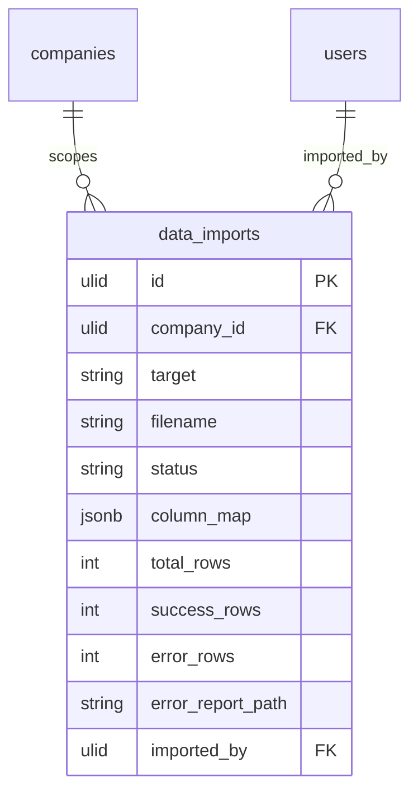

# Data Import — Data Model

Parent: [[_module]] · See also [[architecture]] · [[api]]

Owns one table: `data_imports`.

## data_imports

| Column | Type | Constraints | Notes |
|---|---|---|---|
| id | ulid | PK | |
| company_id | ulid | not null, indexed | |
| target | string | not null | importer key, e.g. `hr.employees` |
| filename | string | not null | original name |
| status | string | not null, default `pending` | state machine |
| column_map | jsonb | not null | source column → field |
| total_rows / success_rows / error_rows | int | default 0 | |
| error_report_path | string | nullable | tenant-scoped file |
| imported_by | ulid | FK users | |
| deleted_at | timestamp | nullable | soft delete |

**Indexes:** `(company_id, created_at)`

## State column values

`status` ∈ `pending` → `processing` → (`complete` \| `failed`). Full transition table in [[architecture]].

