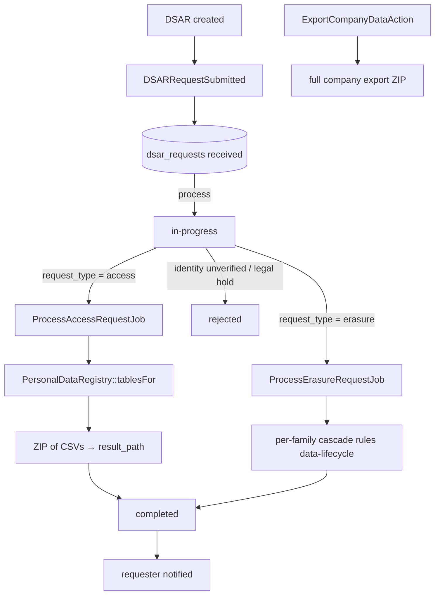

# Data Privacy — Architecture

Parent: [[_module]] · See also [[api]] · [[data-model]]

## PersonalDataRegistry

Central registry that every module populates in its own ServiceProvider — the single source of truth for what counts as PII across the product.

| Method | Behavior |
|---|---|
| `register(string $moduleKey, array $tablesFields)` | each module declares its PII tables/columns |
| `tablesFor(string $email)` | resolves the tables/rows relevant to a data subject — drives export + erasure scope |

## Services & Actions

- `ExportCompanyDataAction::run(): string` — full company export for data portability, owner-triggered; writes a ZIP and returns its path.

## State Machine — `DsarRequestState` (spatie/laravel-model-states)

Column: `dsar_requests.status`. Classes: `Received`, `InProgress`, `Completed`, `Rejected`.

| State | → | Trigger (permission) | Side effects |
|---|---|---|---|
| `received` | `in-progress` | `core.privacy.process` | — (`DSARRequestSubmitted` fires on create, not on transition) |
| `in-progress` | `completed` | export/erasure job success | `completed_at` set, requester notified |
| `in-progress` | `rejected` | `core.privacy.process` (identity unverified / legal hold) | reason recorded |

## Jobs & Scheduling

| Job / Command | Queue | Schedule | Idempotency |
|---|---|---|---|
| `ProcessAccessRequestJob` | exports | on demand | regenerates ZIP, overwrites `result_path` — safe to re-run |
| `ProcessErasureRequestJob` | default | on demand | anonymise writes are naturally re-runnable; per-family ordering FK-safe |
| `DsarDeadlineReminderCommand` | notifications | daily | notifies on `due_at-7d` and `due_at-1d`, WHERE-guarded so each fires once |

Both jobs run `WithCompanyContext`. `ProcessErasureRequestJob` applies per-family cascade rules from [[../../../architecture/data-lifecycle]]; chunked and idempotent.

## Filament Artifacts

**Nav group:** Settings

| Artifact | Kind ([[../../../architecture/ui-strategy]] row) | Blueprint / Tweaks | Notes |
|---|---|---|---|
| `DsarRequestResource` (/app) | #1 CRUD resource | tweaks: state-badge-column (DSAR status), custom-header-actions (Process, Reject; access rows expose the result-ZIP download) | deadline-countdown column; filters: type, status ([[./features/dsar-queue]]) |
| `ConsentLog` resource (/app) | #1 CRUD resource | tweaks: read-only-flow-owned (records appended by consent-capture flows, not hand-edited) | filters: category, active-only ([[./features/consent-log]]) |
| `DataExportPage` (/app) | #9 Report builder / query UI custom page *(assumed — closest blueprint for a single-action export + result pane)* | [[../../../architecture/patterns/page-blueprints#Report Builder / Query UI]] | owner-only full-company export; poll ~30s → download ZIP ([[./features/data-export]]) |

**Access contract (mandatory):** every artifact gates on
`canAccess() = Auth::user()->can('core.privacy.view-any') && BillingService::hasModule('core.privacy')`
per [[../../../architecture/filament-patterns]] #1. `DataExportPage` is a custom page and MUST state this explicitly — it is additionally **owner-only**, requires `core.privacy.export`, and the Export action carries the `exports` rate limiter (one export per company per N minutes — [[security]]). The DSAR Process/Reject actions require `core.privacy.process`. Public/portal DSAR intake, if added, uses a scoped-portal guard (Vue+Inertia per [[../../../architecture/ui-strategy]]).

## Concurrency

| Write path | Tier | Mechanism |
|---|---|---|
| DSAR create (`dsar_requests` row + fire `DSARRequestSubmitted`) | n/a | Insert-once — each request is a new row; no concurrent-edit surface |
| DSAR status transition (`received → in-progress → completed`/`rejected`) | Pessimistic | State machine: `DB::transaction()` + `lockForUpdate()`, re-read, validate, write per [[../../../architecture/patterns/states]] |
| Consent log (give / withdraw) | n/a | Append-only — consent capture inserts a row; withdrawal sets `withdrawn_at` once, no contended edit |
| Export / erasure job writes (`result_path`, status, ZIP) | n/a | Single-writer — one job owns the DSAR row; regenerate/overwrite is idempotent. Erasure target-table writes are **delegated** to each owning domain's eraser |

Tiers per [[../../../decisions/decision-2026-07-02-optimistic-locking-standard]].

## Flow

