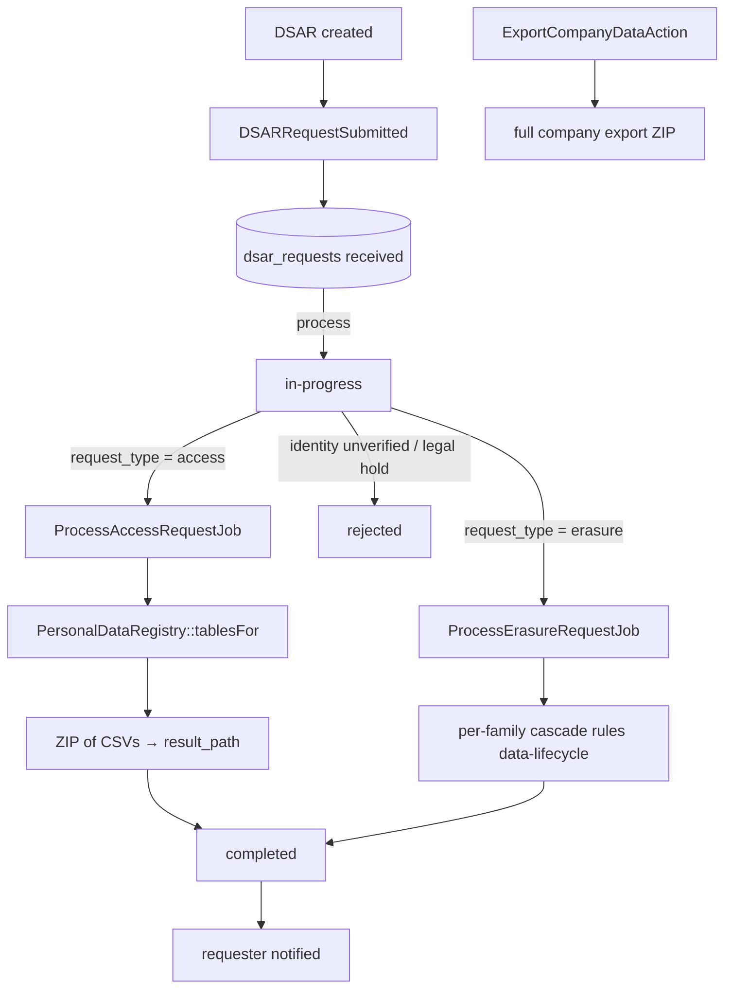

# Data Privacy — Architecture

Parent: [[_module]] · See also [[api]] · [[data-model]]

## PersonalDataRegistry

Central registry that every module populates in its own ServiceProvider — the single source of truth for what counts as PII across the product.

| Method | Behavior |
|---|---|
| `register(string $moduleKey, array $tablesFields)` | each module declares its PII tables/columns |
| `tablesFor(string $email)` | resolves the tables/rows relevant to a data subject — drives export + erasure scope |

## Services & Actions

- `ExportCompanyDataAction::run(): string` — full company export for data portability, owner-triggered; writes a ZIP and returns its path.

## State Machine — `DsarRequestState` (spatie/laravel-model-states)

Column: `dsar_requests.status`. Classes: `Received`, `InProgress`, `Completed`, `Rejected`.

| State | → | Trigger (permission) | Side effects |
|---|---|---|---|
| `received` | `in-progress` | `core.privacy.process` | — (`DSARRequestSubmitted` fires on create, not on transition) |
| `in-progress` | `completed` | export/erasure job success | `completed_at` set, requester notified |
| `in-progress` | `rejected` | `core.privacy.process` (identity unverified / legal hold) | reason recorded |

## Jobs & Scheduling

| Job / Command | Queue | Schedule | Idempotency |
|---|---|---|---|
| `ProcessAccessRequestJob` | exports | on demand | regenerates ZIP, overwrites `result_path` — safe to re-run |
| `ProcessErasureRequestJob` | default | on demand | anonymise writes are naturally re-runnable; per-family ordering FK-safe |
| `DsarDeadlineReminderCommand` | notifications | daily | notifies on `due_at-7d` and `due_at-1d`, WHERE-guarded so each fires once |

Both jobs run `WithCompanyContext`. `ProcessErasureRequestJob` applies per-family cascade rules from [[../../../architecture/data-lifecycle]]; chunked and idempotent.

## Flow

