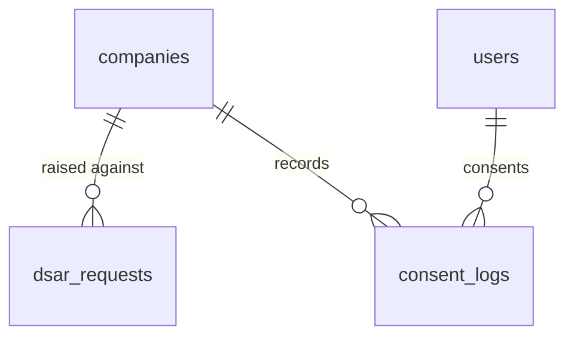

# Data Privacy — Data Model

Parent: [[_module]] · See also [[architecture]] · [[security]]

Tables: `dsar_requests`, `consent_logs`.

## dsar_requests

| Column | Type | Constraints | Notes |
|---|---|---|---|
| id | ulid | PK | |
| company_id | ulid | not null, indexed | |
| subject_email | string | not null | data subject |
| request_type | string | not null | `access` / `erasure` |
| status | string | not null, default `received` | state machine |
| due_at | timestamp | not null | created + 30 days |
| completed_at | timestamp | nullable | |
| result_path | string | nullable | export ZIP (access requests) |
| deleted_at | timestamp | nullable | kept as compliance proof — never purged with company data |

## consent_logs

| Column | Type | Constraints | Notes |
|---|---|---|---|
| id | ulid | PK | |
| company_id | ulid | not null, indexed | |
| user_id | ulid | FK users | |
| data_category | string | not null | |
| consented_at | timestamp | not null | |
| withdrawn_at | timestamp | nullable | null = consent still active |

## State reference — `dsar_requests.status`

| State | Meaning |
|---|---|
| `received` | logged, awaiting processing |
| `in-progress` | export/erasure running |
| `completed` | fulfilled, requester notified |
| `rejected` | identity unverified or blocked by legal hold |

