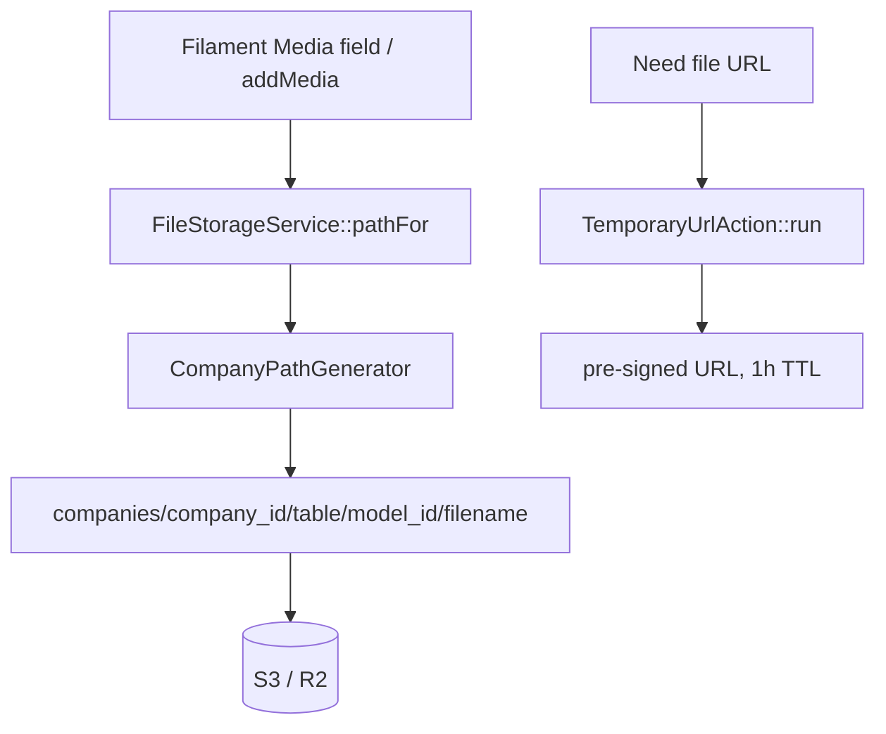

# File Storage — Architecture

Parent: [[_module]] · See also [[data-model]] · [[security]]

## Components

| Component | Role |
|---|---|
| `CompanyPathGenerator` | Media Library `PathGenerator` implementation — enforces the `companies/{company_id}/...` prefix for every original, conversion, and responsive image |
| `FileStorageService` | `pathFor(Model $model, string $filename): string` → `companies/{company_id}/{table}/{model_id}/{filename}` — single method for constructing storage paths |
| `TemporaryUrlAction` | `run(Media $media): string` — issues a pre-signed S3 URL (1h TTL) |

The path generator is bound in `config/media-library.php` so no domain ever calls raw `Storage::put()`; the prefix is applied uniformly, including for generated conversions.

## Flow

No DTOs or events of its own — validation config lives in per-module Data classes; erasure of person-related files is driven by [[../data-privacy/_module]] via [[../../../architecture/data-lifecycle]].

## Filament Artifacts

**Filament Artifacts:** None (backend module — no standalone resource or page; Media Library file fields live inside every other module's own Filament forms, gated by that owning record's permissions). File URLs are issued out-of-band as pre-signed S3 URLs by `TemporaryUrlAction`, not through a Filament artifact.

## Concurrency

| Write path | Tier | Mechanism |
|---|---|---|
| Media store (`media` row + physical file via `CompanyPathGenerator`) | n/a | Insert-once — each upload appends a new `media` row/file; no concurrent-edit surface (metadata is not edited in place) |
| Media delete (GDPR erasure) | n/a | Delete-only, delegated — the owning domain removes its own media on erasure; no contended row |
| `TemporaryUrlAction` | n/a | Read-only — issues a pre-signed URL, writes nothing |

Tiers per [[../../../decisions/decision-2026-07-02-optimistic-locking-standard]].
