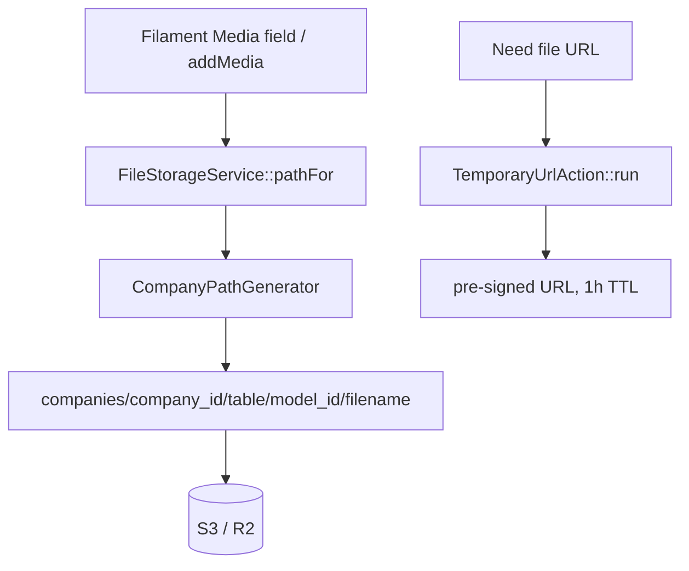

# File Storage — Architecture

Parent: [[_module]] · See also [[data-model]] · [[security]]

## Components

| Component | Role |
|---|---|
| `CompanyPathGenerator` | Media Library `PathGenerator` implementation — enforces the `companies/{company_id}/...` prefix for every original, conversion, and responsive image |
| `FileStorageService` | `pathFor(Model $model, string $filename): string` → `companies/{company_id}/{table}/{model_id}/{filename}` — single method for constructing storage paths |
| `TemporaryUrlAction` | `run(Media $media): string` — issues a pre-signed S3 URL (1h TTL) |

The path generator is bound in `config/media-library.php` so no domain ever calls raw `Storage::put()`; the prefix is applied uniformly, including for generated conversions.

## Flow

No DTOs or events of its own — validation config lives in per-module Data classes; erasure of person-related files is driven by [[../data-privacy/_module]] via [[../../../architecture/data-lifecycle]].
