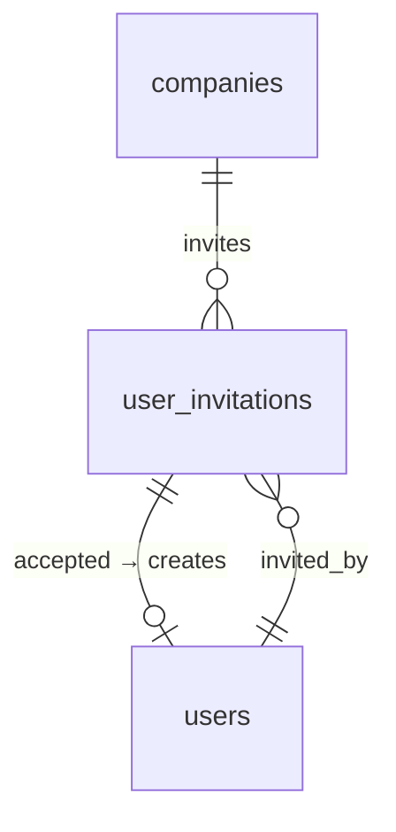

# Invitation System — Data Model

Parent: [[_module]] · See also [[architecture]] · [[security]]

Owns one table: `user_invitations`.

## user_invitations

| Column | Type | Constraints | Notes |
|---|---|---|---|
| id | ulid | PK | |
| company_id | ulid | not null, indexed | |
| email | string | not null | one pending invite per email per company *(assumed)* |
| token | uuid | not null, unique | not hashed — single-use, short-lived |
| role | string | not null | role name to assign |
| invited_by | ulid | not null, FK users | |
| accepted_at | timestamp | nullable | |
| revoked_at | timestamp | nullable | |
| expires_at | timestamp | not null | created + 7 days |

**Indexes:** `(company_id, email)`, `token` unique

