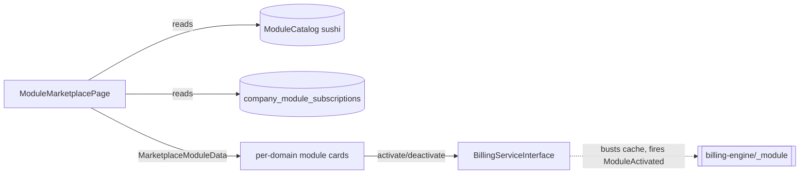

# Module Marketplace — Architecture

Parent: [[_module]]

A single Filament custom page over [[../billing-engine/_module]]. No services, jobs, or state of its own.

| Artifact | Kind (ui-strategy) | Notes |
|---|---|---|
| `ModuleMarketplacePage` (`/app`) | #3-style custom page (grid, no drag) | domain sections, activate/deactivate buttons with confirm modal, price preview per card, live search + toolbar |

Backed by `resources/views/filament/app/pages/module-marketplace.blade.php`.

The page composes `MarketplaceModuleData` DTOs (price preview = unit price × active user count) and delegates all mutations to `BillingServiceInterface::activateModule()` / `deactivateModule()`. See [[../billing-engine/api]].
