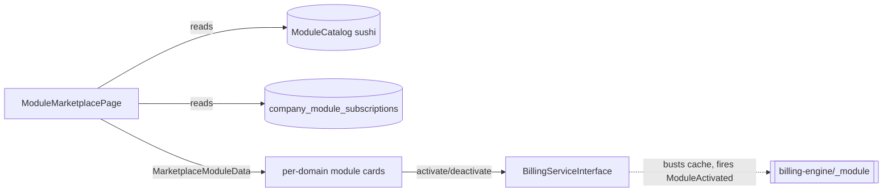

# Module Marketplace — Architecture

Parent: [[_module]]

A single Filament custom page over [[../billing-engine/_module]]. No services, jobs, or state of its own.

## Filament Artifacts

**Nav group:** Marketplace

| Artifact | Kind ([[../../../architecture/ui-strategy]] row) | Blueprint / Tweaks | Notes |
|---|---|---|---|
| `ModuleMarketplacePage` (`/app`) | #17 Gallery / directory grid custom page | [[../../../architecture/patterns/page-blueprints#Gallery / Directory Grid]] | domain-grouped module cards, live search (300ms debounce) + active-count/€-month toolbar, per-card price preview, activate/deactivate confirm modal |

Backed by `resources/views/filament/app/pages/module-marketplace.blade.php`.

**Access contract (mandatory):** `ModuleMarketplacePage` is a custom page and MUST state its gate explicitly — Filament does not auto-gate custom pages:
`canAccess() = Auth::user()->can('core.marketplace.view-any') && BillingService::hasModule('core.marketplace')`
per [[../../../architecture/filament-patterns]] #1. **Owner-only in practice** — the activate/deactivate controls additionally require `core.billing.activate-module` / `core.billing.deactivate-module` and the page enforces owner role at the access layer (permission alone is insufficient — see [[decisions]]).

## Concurrency

| Write path | Tier | Mechanism |
|---|---|---|
| Activate / deactivate module | n/a (delegated) | Marketplace owns no tables and performs no direct writes — it delegates to `BillingServiceInterface::activateModule()` / `deactivateModule()`; the concurrency tier for the subscription mutation is owned by [[../billing-engine/architecture|core.billing]] |
| Catalog / subscription reads | n/a | Read-only browse — no write path ([[catalog-grid]]) |

Tiers per [[../../../decisions/decision-2026-07-02-optimistic-locking-standard]].

The page composes `MarketplaceModuleData` DTOs (price preview = unit price × active user count) and delegates all mutations to `BillingServiceInterface::activateModule()` / `deactivateModule()`. See [[../billing-engine/api]].
