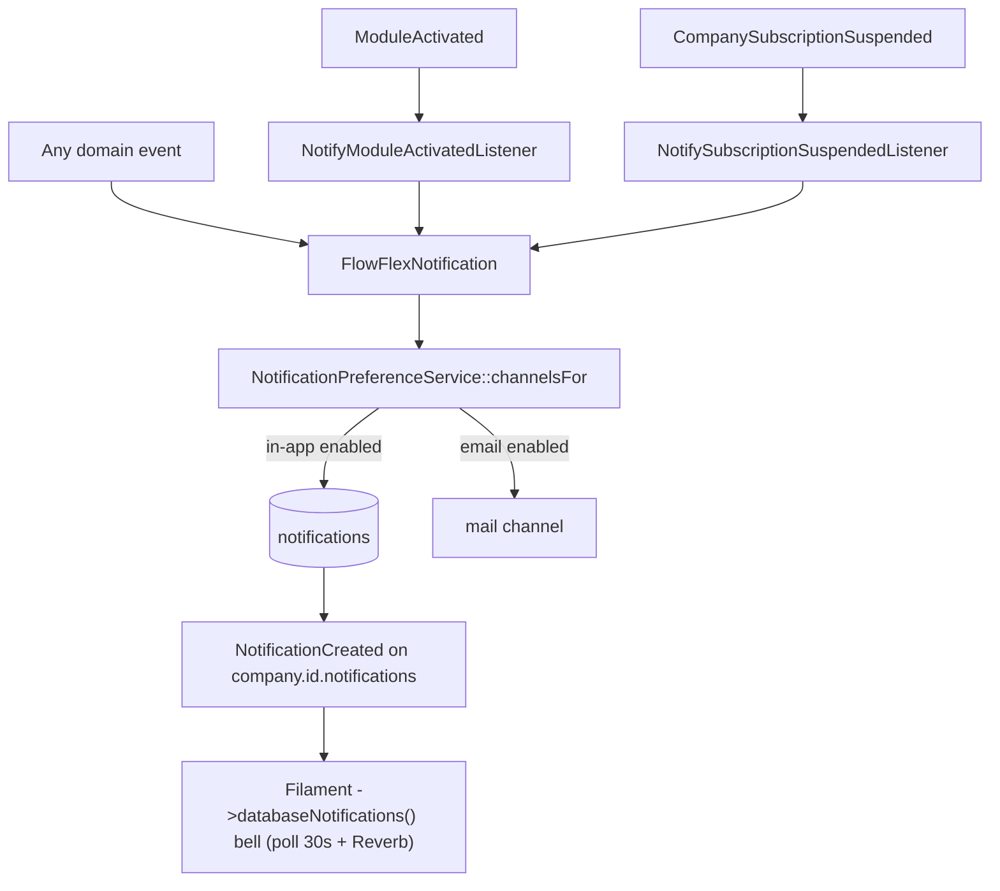

# Notifications — Architecture

Parent: [[_module]] · See also [[api]] · [[data-model]]

## Base notification class

`FlowFlexNotification` (abstract, in `app/Support/Notifications/`) — every domain's Notification extends it. It:

- enforces `company_id` in the payload,
- resolves channels through `NotificationPreferenceService` in its `via()`,
- broadcasts on the company notifications channel,
- is queued on the `notifications` queue.

## Preference service

`NotificationPreferenceService::channelsFor(User $user, string $type): array` — resolves the enabled channels (in-app / email) for a user + notification type. Every domain Notification's `via()` calls this, so a preference toggle universally suppresses that channel.

## Actions

- `MarkAllReadAction::run(User $user): void` — marks the user's whole inbox read.

## Listeners (consumed events)

| Listener | Consumes | Effect |
|---|---|---|
| `NotifyModuleActivatedListener` | `ModuleActivated` | notifies owner/admins a module was activated |
| `NotifySubscriptionSuspendedListener` | `CompanySubscriptionSuspended` | notifies owner (mail must not require panel access) |

Both are queued (`ShouldQueue` + company-context middleware) per [[../../../architecture/event-bus]]. `DSARRequestSubmitted` is a **consumed event on paper** but its listener was **not built** — see [[unknowns]].

## In-app bell

The bell is **Filament's built-in** `->databaseNotifications()` render (with `->databaseNotificationsPolling('30s')`) on each panel — not a custom Livewire component. The ⌘K command palette is a separate concern (`app/Livewire/Spotlight.php`, see [[../spotlight/_module]]).

## Realtime broadcast

`NotificationCreated` (`ShouldBroadcast`) fires on `company.{id}.notifications`. This is the one always-on Reverb broadcast use case — see [[../../../architecture/websockets]] and [[../../../infrastructure/websockets-reverb]].

## Filament Artifacts

**Nav group:** (none — bell is a topbar render hook; preferences under account/settings *(assumed)*)

| Artifact | Kind ([[../../../architecture/ui-strategy]] row) | Blueprint / Tweaks | Notes |
|---|---|---|---|
| Notification bell (all panels) | #10 Notification bell (render hook) | [[../../../architecture/patterns/page-blueprints#Notification Bell (render hook, not a page)]] | Filament built-in `->databaseNotifications()` + `->databaseNotificationsPolling('30s')`; Reverb badge via `NotificationCreated` |
| `NotificationPreferencesPage` | Custom Filament Page (settings form) *(assumed — no board-kind blueprint applies)* | Filament Page hosting a schema form ([[../../../architecture/patterns/custom-pages]]) | per-type × per-channel toggle matrix; saves `UpdateNotificationPreferencesData` |

**Access contract (mandatory):** `core.notifications` is an always-free platform module (always active) with **no permissions** — every user manages their own inbox and preferences. The bell and `NotificationPreferencesPage` therefore gate on authentication only:
`canAccess() = Auth::check()` (no `can()` check, no `BillingService::hasModule()` gate — the module is never inactive)
per [[../../../architecture/filament-patterns]] #1. `NotificationPreferencesPage` is a custom page and states this explicitly — Filament does not auto-gate custom pages. The Reverb channel `company.{id}.notifications` is guarded by its channel-authorization callback (subscriber must belong to `company_id`), not by a Filament gate — see [[security]].

## Concurrency

| Write path | Tier | Mechanism |
|---|---|---|
| Notification create / mark-read / mark-all-read / delete | n/a | Per-user inbox — each row is written only by the delivery path that created it or its owning user; read-state updates are benign last-write, no concurrent-editor conflict surface |
| Preference save | n/a | Single-owner rows — only the authenticated user edits their own `notification_preferences`; no cross-user contention |

Tiers per [[../../../decisions/decision-2026-07-02-optimistic-locking-standard]].

## Flow

