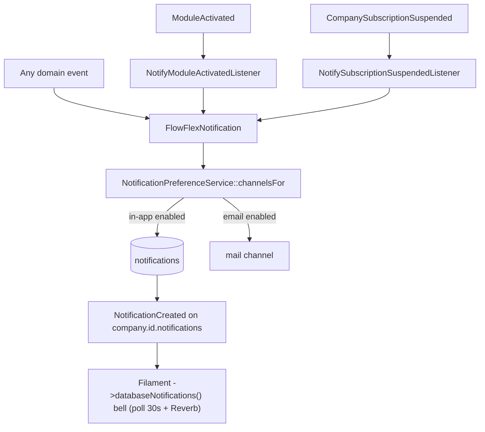

# Notifications — Architecture

Parent: [[_module]] · See also [[api]] · [[data-model]]

## Base notification class

`FlowFlexNotification` (abstract, in `app/Support/Notifications/`) — every domain's Notification extends it. It:

- enforces `company_id` in the payload,
- resolves channels through `NotificationPreferenceService` in its `via()`,
- broadcasts on the company notifications channel,
- is queued on the `notifications` queue.

## Preference service

`NotificationPreferenceService::channelsFor(User $user, string $type): array` — resolves the enabled channels (in-app / email) for a user + notification type. Every domain Notification's `via()` calls this, so a preference toggle universally suppresses that channel.

## Actions

- `MarkAllReadAction::run(User $user): void` — marks the user's whole inbox read.

## Listeners (consumed events)

| Listener | Consumes | Effect |
|---|---|---|
| `NotifyModuleActivatedListener` | `ModuleActivated` | notifies owner/admins a module was activated |
| `NotifySubscriptionSuspendedListener` | `CompanySubscriptionSuspended` | notifies owner (mail must not require panel access) |

Both are queued (`ShouldQueue` + company-context middleware) per [[../../../architecture/event-bus]]. `DSARRequestSubmitted` is a **consumed event on paper** but its listener was **not built** — see [[unknowns]].

## In-app bell

The bell is **Filament's built-in** `->databaseNotifications()` render (with `->databaseNotificationsPolling('30s')`) on each panel — not a custom Livewire component. The ⌘K command palette is a separate concern (`app/Livewire/Spotlight.php`, see [[../spotlight/_module]]).

## Realtime broadcast

`NotificationCreated` (`ShouldBroadcast`) fires on `company.{id}.notifications`. This is the one always-on Reverb broadcast use case — see [[../../../architecture/websockets]] and [[../../../infrastructure/websockets-reverb]].

## Flow

