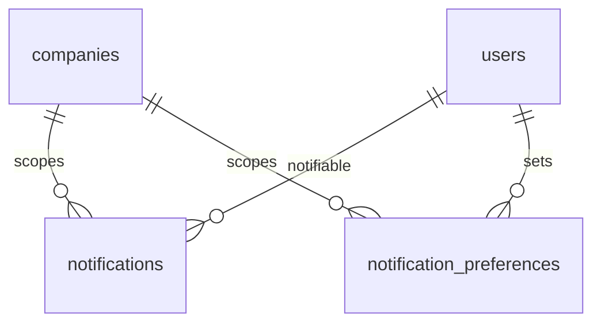

# Notifications — Data Model

Parent: [[_module]] · See also [[architecture]] · [[security]]

Owns two tables: `notifications` (Laravel standard, extended) and `notification_preferences`.

## notifications

| Column | Type | Notes |
|---|---|---|
| id | uuid | PK (framework convention) |
| notifiable_type / notifiable_id | string / ulid | target user |
| type | string | notification class |
| data | jsonb | title, body, action_url, domain |
| read_at | timestamp | nullable |
| company_id | ulid | indexed — added column |
| created_at | timestamp | |

## notification_preferences

| Column | Type | Notes |
|---|---|---|
| id | ulid | PK |
| company_id | ulid | indexed |
| user_id | ulid | FK users |
| notification_type | string | class or type key |
| in_app_enabled | boolean | default true |
| email_enabled | boolean | default true |

**Index:** `(user_id, notification_type)` unique

