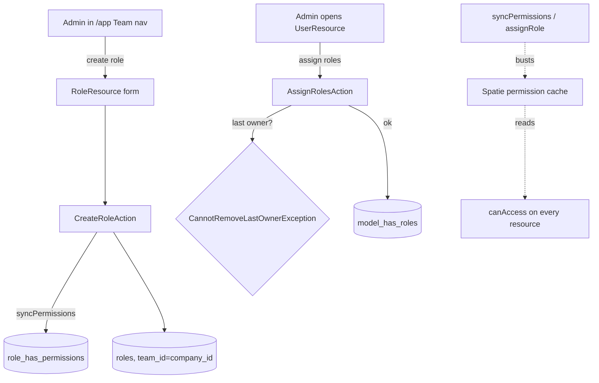

# RBAC — Architecture

Simple-ops pattern: three Actions (`lorisleiva/laravel-actions`) over the Spatie permission tables. No service layer — Filament resources call the Actions directly.

## Actions (`app/Actions/`)

| Action | Signature | Notes |
|---|---|---|
| `CreateRoleAction` | `run(CreateRoleData): Role` | creates role under the current company team, syncs permissions |
| `AssignRolesAction` | `run(AssignRolesData): void` | throws `CannotRemoveLastOwnerException` |
| `DeleteRoleAction` | `run(string $roleId): void` | throws `CannotDeleteBuiltInRoleException`; refuses while users assigned *(assumed)* |
| `TransferOwnershipAction` | `run(string $newOwnerId): void` *(assumed signature)* | atomically assigns `owner` to the new user and demotes the previous owner; fires `OwnershipTransferred` *(assumed)* — see [[features/ownership]] |

## Exceptions (`app/Exceptions/`)

- `CannotRemoveLastOwnerException` — guards demotion/removal of the final `owner`.
- `CannotDeleteBuiltInRoleException` — guards deletion of `owner`/`admin`/`manager`/`employee`.

## Filament Artifacts

**Nav group:** Team

| Artifact | Kind ([[../../../architecture/ui-strategy]] row) | Blueprint / Tweaks | Notes |
|---|---|---|---|
| `RoleResource` | #1 CRUD resource | tweaks: custom-header-actions (none non-CRUD) | shield-generated permission matrix grouped by domain; **only active-module groups render** ([[features/module-scoped-permissions]]); built-in roles non-deletable |
| `UserResource` | #1 CRUD resource | tweaks: custom-header-actions (assign-roles, deactivate, transfer-ownership, invite [soft-dep on invitations]) | list users; assign one-or-more roles; transfer-ownership is a destructive typed-confirm action, owner-only ([[features/ownership]]) |

**Access contract (mandatory):** `core.rbac` is an always-free platform module (always active), so there is no `hasModule()` gate — both resources gate on permission only:
`canAccess() = Auth::user()->can('core.rbac.view-any')`
per [[../../../architecture/filament-patterns]] #1. Non-CRUD header actions each carry their own permission (`assign-roles`, `transfer-ownership` — see [[security]]); the invite action additionally requires the invitation-system soft-dep and is hidden without it.

## Concurrency

| Write path | Tier | Mechanism |
|---|---|---|
| Role create / update / delete (`RoleResource`) | Optimistic | `updated_at` stale-check on save → `StaleRecordException` → conflict notification ([[../../../architecture/patterns/optimistic-locking]]) |
| Role assignment (`AssignRolesAction`) | Pessimistic | last-owner invariant re-checked under lock — `DB::transaction()` + `lockForUpdate()` on the company's owner assignments so two concurrent demotions cannot leave zero owners ([[../../../architecture/patterns/states]]) |
| Ownership transfer (`TransferOwnershipAction`) | Pessimistic | atomic demote-previous + promote-new under `lockForUpdate()`; no window with zero or two owners ([[../../../architecture/patterns/states]]) |

Tiers per [[../../../decisions/decision-2026-07-02-optimistic-locking-standard]].

## Role / permission flow

## Related

- [[_module]] · [[data-model]] · [[api]] · [[security]]
- [[../../../architecture/patterns/policy]] · [[../../../architecture/caching]]
